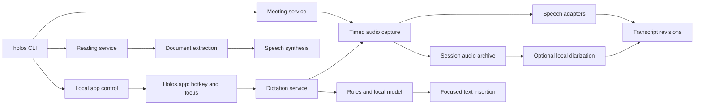

# Holos: design proposal

Draft dated 2026-09-22. This is a proposal for discussion, not an implementation
claim. English first is confirmed. The user will provide Otter and Wispr audio and
text before implementation evaluation. Permission to use downloaded, open-source
models for missing native capabilities remains an open product choice.

## Recommendation

Build one Swift package with shared libraries, a `holos` command, and a small
`Holos.app` background application for dictation. Keep meeting recording and reading
aloud independently usable from the terminal. Subcommands give separate workflows
without duplicating engines; standalone aliases can follow if useful.

Target this Apple Silicon Mac and macOS 27 initially. Most core APIs also exist on
macOS 26, but supporting older systems is a separate decision and test obligation.
Use the installed Swift 6.4 toolchain in Swift 6 language mode.

All speech and language-model inference runs locally. Fetching a requested article
and initially downloading speech/voice/model assets may use the network. An offline
operation with missing assets reports what is missing. It does not choose a server
model. In particular, explicitly use `SystemLanguageModel` for corrections; macOS 27
Foundation Models also exposes remote providers, which are outside this design.

## What the available APIs actually cover

| Need | Proposed implementation | Qualification |
| --- | --- | --- |
| Long recordings and timestamped text | Speech framework: `SpeechAnalyzer` + `SpeechTranscriber` | Designed for conversational and long-form audio; manage model assets and incremental results. [1, 2] |
| Short dictation | Benchmark `SpeechTranscriber` against `DictationTranscriber` | Do not select solely by the class name. Vocabulary customization is specifically documented for `DictationTranscriber`. [3] |
| Microphone audio | AVFoundation / AVAudioEngine | Capture with explicit start/stop and retain timing information. |
| Remote meeting audio | ScreenCaptureKit system/app audio; separate microphone output | Capturing the microphone alone is insufficient when using headphones. ScreenCaptureKit supports both sources. [4] |
| Speaker turns | Separate diarization stage | No public speaker IDs were found in the installed Speech SDK/result API. This is a finding from the inspected surface, not proof of all future Apple capabilities. [2] |
| Natural-language correction decisions | Foundation Models, bounded structured responses | Optional; rules and transcription still work if the model is unavailable. [5] |
| Speech playback and audio export | `AVSpeechSynthesizer` with buffer output | Audition installed voices and test file export per voice. Do not assume availability implies the desired quality. [6] |
| Global hotkey and insertion | AppKit, CoreGraphics events, Accessibility | Behavior depends on the focused application's accessibility support. [7] |
| PDFs and scanned documents | PDFKit text extraction, then Vision OCR | Later input adapters; Vision is not the speech recognizer. |

There is no verified native-only route here to reliable automatic multi-speaker
labeling. A practical optional candidate is FluidAudio's local Swift/Core ML
diarization. Evaluate its offline pipeline and review the chosen code/model
licenses, download size, and memory usage before selecting a version. [8]

Three concepts must stay separate: **transcription** produces words,
**diarization** groups turns as Speaker 1/2/3, and **identification** associates a
speaker with a known person. Renaming a session's speaker is straightforward;
recognizing that person in future sessions needs an additional opt-in enrollment
and matching feature. Foundation Models cannot infer reliable speaker identity
from transcript prose.

### Observed on this Mac

Read-only checks on 2026-09-22 found:

- macOS 27.0, build 26A428; arm64; Swift 6.4; Command Line Tools SDK available.
- `SystemLanguageModel.default.availability == .available`.
- The model reports an **8,192-token** context window. Query this at runtime;
  older documentation describing 4,096 tokens must not become a fixed constant.
- Both transcribers advertise English locales including `en_CA` and `en_US`.
- The checked `SpeechTranscriber` configuration for `en_CA` reports asset status
  `.supported`, not `.installed`. Setup must verify/install the required assets.
- `AVSpeechSynthesisVoice.speechVoices()` reports 187 entries, including English
  entries of enhanced quality. No synthesis or export quality was tested.
- For a possible later Ukrainian milestone, `DictationTranscriber` advertises
  `uk_UA`; the checked `SpeechTranscriber` and Foundation Models language lists do
  not advertise Ukrainian. Each engine needs its own capability check.

These checks did not record audio, install models, request permissions, or assess
recognition quality. The public Speech interface contains timestamps, alternatives,
and confidence attributes, but no speaker identifier was found.

## User-facing tools

The command spelling is provisional. `record start` is foreground by default;
Ctrl-C stops capture, flushes the recording, and finalizes pending text. The same
session can be stopped from another terminal using its printed ID.

```sh
holos doctor
holos setup --locale en-CA

holos dictate enable                 # start the background app
holos dictate disable
holos corrections add "whisper flow" "Wispr Flow"
holos corrections list

holos record start --name "Planning" --source mic+system
holos record status
holos record stop <session-id>
holos transcribe ./interview.m4a
holos session speakers <session-id>
holos session rename-speaker <session-id> speaker-2 "Alex"
holos session play <session-id> --from 00:12:30
holos session export <session-id> --format markdown

holos say "The build is ready."
printf '%s\n' "Piped text" | holos say
holos say --output greeting.m4a "Hello."
holos read https://example.com/article --play
holos read ./article.md
holos voices list
```

`doctor` checks capabilities without prompting. `setup` explains/downloads required
assets and invokes only permissions needed by the selected feature. Permission
denials should give a useful action and leave unrelated commands working.

### Dictation

Use an accessory/menu-bar application in the user's login session, with an optional
login item and a stable bundle identifier. It owns the hotkey, microphone session,
small non-activating status overlay, and Accessibility integration. A system daemon
is not appropriate for interacting with the logged-in desktop.

On hotkey down, capture the focused application/element/selection and start audio.
Show provisional words only in the overlay. On release, finalize, apply corrections,
revalidate the destination, and insert once. Esc cancels without insertion. The
recognizer may stay warm while enabled, but the microphone is active only while
dictating. Readiness must be visible so initial syllables are not silently lost.

Prefer supported Accessibility text-range insertion. Use paste as a fallback with
careful preservation of clipboard types and change-count checks. Never overwrite
an entire field just because selected-text replacement is unsupported. Clipboard
restoration has a race with asynchronous paste consumers; test it per application,
and offer explicit copy if reliable insertion/restoration cannot be established.

Check focus and selection again immediately before writing. If the user switched
fields, retain the result for an explicit paste. Exclude secure/password fields and
respect secure input. Do not synthesize Return or auto-submit. A terminal must not
receive an unexpected trailing newline. "Anywhere" means broad tested coverage,
with a visible copy fallback for unsupported fields.

The first app matrix should include TextEdit, a browser textarea/contenteditable,
VS Code, a terminal, and the user's actual chat/mail applications. The latter list
can be supplied with the Wispr references. Microphone, Accessibility, and possibly
Input Monitoring permission depend on the chosen APIs; validate under the actual
installed app identity, not just `swift run`.

### Learning corrections

Maintain a local database of vocabulary, explicit substitutions, and confirmed
examples. This is memory and retrieval, not automatic fine-tuning of Apple's model.

1. Apply confirmed, scoped rules with token/phrase boundaries and deterministic
   precedence. Scope by locale and optionally application/domain.
2. When supported by the chosen recognizer, pass a small relevant vocabulary set.
   Apple's documented contextual-string support is for `DictationTranscriber`;
   do not assume it also biases `SpeechTranscriber`. [3]
3. For an ambiguous candidate, ask the local language model to select among known
   replacements or leave unchanged. Validate the selected edit in code.
4. Keep the raw transcript and the applied edit record. Never allow a correction
   pass to invent a new sentence or rewrite unrelated names, amounts, or negation.

Start with an explicit "correct last dictation" action: select the corrected text,
invoke the action, and review the extracted correction. Subsequently, offer an
opt-in observer restricted to the recently inserted span in the same field. Expire
it after a short window, focus change, or unrelated editing. Accessibility does not
provide reliable general-purpose edit tracking in every app; uncertain diffs become
suggestions, not permanent rules. Edits may reflect changed intent, not recognition
mistakes. Do not learn from ordinary typing elsewhere.

LLM decisions have a bounded latency budget. On timeout, refusal, unsupported
language, model unavailability, or invalid output, use deterministic rules plus
the transcript. A valid structured response is not evidence that the edit is right.
General prose polishing can be a separate opt-in feature after correctness is measured.

### Meetings

Record the microphone and remote/system audio into **separate timed tracks**. A
system track can contain several people and other app sounds; it is not a speaker
identity. Prefer an app filter where reliable. Headphones reduce acoustic leakage;
without them, remote speech can occur on both tracks and needs overlap/echo handling.

Treat recorded audio as the recoverable source of truth. Write bounded PCM chunks
to disk independently of transcription. Default chunk duration, e.g. 30 seconds,
must be tested and tunable. Index all chunks on a shared session timeline and keep
format changes, gaps, and discontinuities explicit. Native sample rates may differ;
create a separate normalized stream for each analyzer instead of modifying masters.

Use live text for feedback and offline finalization/reprocessing for the durable
transcript. A slow or failed recognizer must not stall recording: retain a backlog
on disk and mark the unprocessed interval. A full disk or failed writer must surface
as a recording failure, preserving existing material. Rotate/finalize chunks so a
crash risks only the active tail, with recovery behavior measured in the first spike.

Persist stream timestamps against a monotonic session origin. Drift, resampling,
device changes, and sleep/resume need explicit treatment. A switched input device
starts a new format epoch. Record interruptions as gaps; never present missing
audio as uninterrupted speech. Prevent idle sleep during an explicitly active
recording where supported; lid close and system suspension remain interruption cases.

Prefer capturing the meeting application's audio when it can be isolated; exclude
Holos's own playback where supported. Keep remote audio and microphone tracks
separate. With loudspeakers, the microphone can also hear remote voices: this causes
echo/duplicate transcription and must not be mistaken for another speaker. Headsets
are the first supported setup; evaluate echo handling before claiming speakerphone
quality. Source tracks alone distinguish microphone from system output, not all
meeting participants.

After recording, optionally run diarization across the full session. Assign stable
session speaker IDs, with editable display names. Permit unknown and overlapping
speakers; do not force every word into one speaker. Preserve word timing when
splitting a sentence across a speaker turn. Manual rename/split/merge/reassignment
are edits over machine results. Reprocessing creates a new revision and flags
ambiguous transfers of existing human edits instead of silently discarding them.

With strict Apple-only dependencies, ship timestamped text, manual speaker tagging,
and distinguishable source tracks first. Fully automatic multi-speaker labels remain
a requirement for the eventual Otter subset, not something the native baseline
should claim to have solved.

### Text-to-speech

Preserve AITTS's useful interaction patterns: immediate speech from arguments/stdin,
queued playback, long text/URL input, saved source, ordered parts, and a playlist.
Use a per-user playback lock and stale-message timeout so concurrent terminal
callers do not talk over one another. Rendering and playback are separate stages.

Use AVSpeechSynthesizer buffer output with AVAudioFile/AVFoundation encoding.
Start with AAC in `.m4a` plus WAV/CAF for lossless/debug use. Native MP3 encoding and
OpenAI-style free-form voice instructions are not promised. Expose voice, rate,
pitch, and pauses supported by the engine. Treat rate as a documented application
setting rather than claiming parity with AITTS's speed multiplier.

For long content, extract a clean document with title, attribution, headings, and
paragraphs; split at semantic boundaries; synthesize sequentially first; save an
ordered `.m3u8` playlist and manifest. Resume at failed/missing chunks using hashes
of text, voice, engine version when available, and synthesis settings. A partial
playlist must be explicitly identified as incomplete and return a nonzero status.

Local text/Markdown precedes HTML articles. Swift has no assumed built-in equivalent
of AITTS's Trafilatura: use a separately tested article-extraction adapter, potentially
vendoring Mozilla Readability plus a suitable HTML DOM dependency. JavaScriptCore
alone supplies no browser DOM. Freeze the extraction dependency only after a small
prototype. Preserve source text for inspection; dynamic/authenticated pages can use
a pasted/local-text fallback. PDFKit and Vision are later adapters. Foundation Models
is not the default article extractor or narrator: it could omit source content.

Audition and export a short set of native voices before investing in the reading
pipeline. Workflow replacement is feasible; equivalence to the preferred OpenAI
voice is a subjective requirement that needs listening tests.

## Architecture and storage



The shared capture box denotes library reuse, not a required global audio daemon.
Meeting capture and dictation are separate session instances. Test concurrent use;
if the hardware/API combination conflicts, keep the recording intact and report
dictation unavailable. Add a microphone broker only if measurements justify it.

Use Swift Package Manager for libraries and the CLI, Swift Argument Parser for
commands, and a thin app-bundle target/build step for macOS integration. Use a small
local control interface for app status/enable/disable. If recording needs a bundled
worker for reliable permission attribution, settle that in the permissions spike;
do not make a recording depend on the hotkey app remaining enabled.

Store app configuration and SQLite correction memory under Application Support.
Allow a configurable session/output root. A session is a portable directory:

```text
<id>.holos/
  manifest.json                    # version, clock, tracks, engine provenance
  audio/mic/000001.caf              # immutable finalized chunks
  audio/system/000001.caf
  events.jsonl                     # durable recording/processing events
  transcripts/<revision>.json      # immutable machine transcript
  edits.jsonl                      # rename/correction operations
  exports/transcript.md            # reproducible views
```

Use one writer/lock per session and atomic manifest/snapshot replacement. Process
events append durably; recovery tolerates a torn final record. The audio write path
must not wait for a language model or an unbounded async stream. SQLite is useful
for correction rules; it is unnecessary as the sole container for large audio.

Budget disk space from actual capture formats. For example, stereo 48 kHz float32
PCM is about 1.38 GB per hour for one track, before the microphone track. Monitor
free space and surface a clear stop condition; compression is a later measured
storage tradeoff, not an excuse to discard the full recording.

Meeting audio is retained by default until the user removes it. Dictation audio is
ephemeral by default; confirmed corrections are retained, while recent raw results
have a configurable short retention period. Debug logs contain timing/status rather
than full documents. No recording or transcript is committed as a test fixture
without deliberate selection. No inferred cross-meeting voiceprint database.

## Decisions to settle during discussion

- **Speaker separation:** accept a downloaded local model, or keep the initial
  release Apple-only with manual speaker labels? The optional adapter accommodates
  either answer; no dependency is selected yet.
- **First daily-use milestone:** default recommendation is file transcription and
  TTS feasibility, then reliable push-to-talk, then robust meeting capture and
  automatic speakers. Different feature branches can proceed after contracts settle.
- **Voice bar and app coverage:** select an acceptable native narration voice and
  the actual target applications using the upcoming reference material.

Deferred: cross-meeting identity enrollment, multi-language/code-switched dictation,
automatic meeting summaries, cloud sync, calendar bots, a large meeting UI, voice
cloning, and broad OS compatibility. A small transcript review window may follow
the CLI once rename/edit/playback requirements are clear.

## References

Checked 2026-09-22. Installed SDK declarations and runtime probes supplement online
documentation, which may describe earlier model versions.

1. [Apple: SpeechAnalyzer and long-form transcription](https://developer.apple.com/videos/play/wwdc2025/277/).
2. [Apple: SpeechTranscriber.Result](https://developer.apple.com/documentation/speech/speechtranscriber/result).
3. [Apple: AnalysisContext.contextualStrings](https://developer.apple.com/documentation/speech/analysiscontext/contextualstrings).
4. [Apple: ScreenCaptureKit microphone and system capture](https://developer.apple.com/videos/play/wwdc2024/10088/).
5. [Apple: Foundation Models availability and generation](https://developer.apple.com/documentation/foundationmodels/generating-content-and-performing-tasks-with-foundation-models), [runtime context size](https://developer.apple.com/documentation/foundationmodels/systemlanguagemodel/contextsize).
6. [Apple: AVSpeechSynthesizer audio buffer output](https://developer.apple.com/documentation/avfaudio/avspeechsynthesizer/write(_:tobuffercallback:)).
7. [Apple: AXUIElement application accessibility](https://developer.apple.com/documentation/applicationservices/axuielement_h).
8. [FluidAudio](https://github.com/FluidInference/FluidAudio), [offline diarization guide](https://github.com/FluidInference/FluidAudio/blob/main/Documentation/Diarization/GettingStarted.md), [benchmark methodology and streaming limitations](https://github.com/FluidInference/FluidAudio/blob/main/Documentation/Benchmarks.md).
