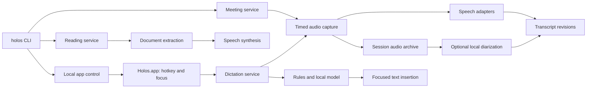

# Holos: design proposal

Draft dated 2026-09-22. This is a proposal for discussion, not an implementation
claim. English first is confirmed. The user will provide Otter and Wispr audio and
text before implementation evaluation. Permission to use downloaded, open-source
models for missing native capabilities remains an open product choice.

## Recommendation

Build one Swift package with shared libraries, a `holos` command, and a small
`Holos.app` background application for dictation. Keep meeting recording and reading
aloud independently usable from the terminal. Subcommands give separate workflows
without duplicating engines; standalone aliases can follow if useful.

Target this Apple Silicon Mac and macOS 27 initially. Most core APIs also exist on
macOS 26, but supporting older systems is a separate decision and test obligation.
Use the installed Swift 6.4 toolchain in Swift 6 language mode.

All speech and language-model inference runs locally. Fetching a requested article
and initially downloading speech/voice/model assets may use the network. An offline
operation with missing assets reports what is missing. It does not choose a server
model. In particular, explicitly use `SystemLanguageModel` for corrections; macOS 27
Foundation Models also exposes remote providers, which are outside this design.

## What the available APIs actually cover

| Need | Proposed implementation | Qualification |
| --- | --- | --- |
| Long recordings and timestamped text | Speech framework: `SpeechAnalyzer` + `SpeechTranscriber` | Designed for conversational and long-form audio; manage model assets and incremental results. [1, 2] |
| Short dictation | Benchmark `SpeechTranscriber` against `DictationTranscriber` | Do not select solely by the class name. Vocabulary customization is specifically documented for `DictationTranscriber`. [3] |
| Microphone audio | AVFoundation / AVAudioEngine | Capture with explicit start/stop and retain timing information. |
| Remote meeting audio | ScreenCaptureKit system/app audio; separate microphone output | Capturing the microphone alone is insufficient when using headphones. ScreenCaptureKit supports both sources. [4] |
| Speaker turns | Separate diarization stage | No public speaker IDs were found in the installed Speech SDK/result API. This is a finding from the inspected surface, not proof of all future Apple capabilities. [2] |
| Natural-language correction decisions | Foundation Models, bounded structured responses | Optional; rules and transcription still work if the model is unavailable. [5] |
| Speech playback and audio export | `AVSpeechSynthesizer` with buffer output | Audition installed voices and test file export per voice. Do not assume availability implies the desired quality. [6] |
| Global hotkey and insertion | AppKit, CoreGraphics events, Accessibility | Behavior depends on the focused application's accessibility support. [7] |
| PDFs and scanned documents | PDFKit text extraction, then Vision OCR | Later input adapters; Vision is not the speech recognizer. |

There is no verified native-only route here to reliable automatic multi-speaker
labeling. A practical optional candidate is FluidAudio's local Swift/Core ML
diarization. Evaluate its offline pipeline and review the chosen code/model
licenses, download size, and memory usage before selecting a version. [8]

Three concepts must stay separate: **transcription** produces words,
**diarization** groups turns as Speaker 1/2/3, and **identification** associates a
speaker with a known person. Renaming a session's speaker is straightforward;
recognizing that person in future sessions needs an additional opt-in enrollment
and matching feature. Foundation Models cannot infer reliable speaker identity
from transcript prose. Holos now has that feature, opt-in and limited to
confirmed labels (see "Voice profiles" below).

### Observed on this Mac

Read-only checks on 2026-09-22 found:

- macOS 27.0, build 26A428; arm64; Swift 6.4; Command Line Tools SDK available.
- `SystemLanguageModel.default.availability == .available`.
- The model reports an **8,192-token** context window. Query this at runtime;
  older documentation describing 4,096 tokens must not become a fixed constant.
- Both transcribers advertise English locales including `en_CA` and `en_US`.
- The checked `SpeechTranscriber` configuration for `en_CA` reports asset status
  `.supported`, not `.installed`. Setup must verify/install the required assets.
- `AVSpeechSynthesisVoice.speechVoices()` reports 187 entries, including English
  entries of enhanced quality. No synthesis or export quality was tested.
- For a possible later Ukrainian milestone, `DictationTranscriber` advertises
  `uk_UA`; the checked `SpeechTranscriber` and Foundation Models language lists do
  not advertise Ukrainian. Each engine needs its own capability check.

These checks did not record audio, install models, request permissions, or assess
recognition quality. The public Speech interface contains timestamps, alternatives,
and confidence attributes, but no speaker identifier was found.

## User-facing tools

The command spelling is provisional. `record start` is foreground by default;
Ctrl-C stops capture, flushes the recording, and finalizes pending text. The same
session can be stopped from another terminal using its printed ID.

```sh
holos doctor
holos setup --locale en-CA

holos dictate enable                 # start the background app
holos dictate disable
holos corrections add "whisper flow" "Wispr Flow"
holos corrections list

holos record start --name "Planning" --source mic+system
holos record status
holos record stop <session-id>
holos transcribe ./interview.m4a
holos session speakers <session-id>
holos session rename-speaker <session-id> speaker-2 "Alex"
holos session play <session-id> --from 00:12:30
holos session export <session-id> --format markdown

holos say "The build is ready."
printf '%s\n' "Piped text" | holos say
holos say --output greeting.m4a "Hello."
holos read https://example.com/article --play
holos read ./article.md
holos voices list
```

`doctor` checks capabilities without prompting. `setup` explains/downloads required
assets and invokes only permissions needed by the selected feature. Permission
denials should give a useful action and leave unrelated commands working.

### Dictation

Use an accessory/menu-bar application in the user's login session, with an optional
login item and a stable bundle identifier. It owns the hotkey, microphone session,
small non-activating status overlay, and Accessibility integration. A system daemon
is not appropriate for interacting with the logged-in desktop.

On hotkey down, capture the focused application/element/selection and start audio.
Show provisional words only in the overlay. On release, finalize, apply corrections,
revalidate the destination, and insert once. Esc cancels without insertion. The
recognizer may stay warm while enabled, but the microphone is active only while
dictating. Readiness must be visible so initial syllables are not silently lost.

Prefer supported Accessibility text-range insertion. Use paste as a fallback with
careful preservation of clipboard types and change-count checks. Never overwrite
an entire field just because selected-text replacement is unsupported. Clipboard
restoration has a race with asynchronous paste consumers; test it per application,
and offer explicit copy if reliable insertion/restoration cannot be established.

Check focus and selection again immediately before writing. If the user switched
fields, retain the result for an explicit paste. Exclude secure/password fields and
respect secure input. Do not synthesize Return or auto-submit. A terminal must not
receive an unexpected trailing newline. "Anywhere" means broad tested coverage,
with a visible copy fallback for unsupported fields.

The first app matrix should include TextEdit, a browser textarea/contenteditable,
VS Code, a terminal, and the user's actual chat/mail applications. The latter list
can be supplied with the Wispr references. The app needs Microphone and
Accessibility. Its hold-to-talk key uses an active CGEvent tap (it consumes the
shortcut), which macOS authorises with Accessibility; Input Monitoring is what
listen-only taps need, so it is not requested. Only if `CGEvent.tapCreate` still
fails with Accessibility granted does the app name Input Monitoring as the fallback
and show it in Settings. Validate under the actual installed app identity, not just
`swift run`.

### Main window

The app's windows other than the transient ones are one main window, "Voice is Local"
(`MainWindowController`, Sources/HolosApp/MainWindow): an `NSSplitViewController` with a
native source-list sidebar and the selected section's content. Sections: Dictation ›
History (⌘1), Corrections (⌘2); Meetings › Meetings (⌘3), People (⌘4); Listen › Reading
(⌘5, a placeholder that points to `voiceislocal read`); Settings (⌘,). A status card at
the sidebar's bottom shows the dictation state and message ("Dictation paused during
meeting recording" while a meeting records). The window is 1280 × 800 by default
(900 × 560 at least), remembers its frame and sidebar width, and opens from the menu's
**Open Voice is Local** (⌘0), from History / Meetings / Settings… there, from the main
menu's Go and Window menus (shown while the window is key), and from every "Setup…"
path (the launch with dictation off, a refused enable, the assistant's "Open Settings").
Each section is a view controller created on first use and kept: Corrections, Meetings,
and People are the former windows' view hierarchies unchanged in behaviour (Meetings
still drives Quick Look through the main window, `PreviewingWindow`; its 2 s refresh and
People's reread run while the section is on screen). Settings is the former Setup window
in cards: Permissions (Microphone, Accessibility, System audio, Input Monitoring only
after macOS refused the hotkey tap), Dictation (on/off, hold-to-talk shortcut, language,
speech model, fillers, Apple Intelligence fix, preview and its opacity), Meetings (record
system audio, speaker labels, a link to People for remembered voices), History and
privacy (Keep dictations, the count, Clear History…, Keep the audio of dictations and its
disk use), and Run Setup Assistant…; it polls
the permissions every second while on screen. The Setup Assistant, the meeting start
panel, the live transcript, Review (Name Speakers), and the dictation preview stay
separate windows.

Keyboard: ⌘1–⌘5 and ⌘, switch sections; ⌘F focuses the section's search field; ↑↓ move
in lists, Return opens (History: the text; Meetings: Review or the transcript), ⌫ deletes
after a confirmation (History: the dictation; Meetings: Delete Meeting…; People:
Forget…); in History, Space plays or pauses the selected dictation's audio and ⌘R runs it
again; Tab reaches the sidebar, list, and detail. A key does exactly what its button
does and only while that button is enabled (Meetings: `MeetingActionPolicy`, so ⌫ on a
meeting another process holds only beeps; People: not while a change saves; History:
⇧⌘C only for a dictation the fixes changed, ⌘R only for one with audio and no Run Again
running); Edit › Copy is off with no dictation
selected. Escape keeps `AppKeyboard`'s rule
(it closes the key window unless a field is being edited or a dictation runs). Controls
are standard AppKit controls with semantic colours, so light and dark mode, Full
Keyboard Access, and VoiceOver work without custom handling.

The menu bar menu keeps what is needed without the window: the status line, the
dictation toggle (and Cancel Dictation while one runs), Copy Result / Copy Original /
Discard Result while a result is kept, Correct Last Dictation…, the meeting block, then
Open Voice is Local, History, Meetings, Settings…, About, and Quit. The language and
shortcut submenus moved to Settings.

### Dictation history

Each finished dictation that produced text is recorded (`DictationRecord`, HolosCore):
its utterance ID, time, the target app's display name (the typed-into app for keystroke
targets, else the owner of the Accessibility target or the frontmost app at key-down,
through `NSRunningApplication`), the locale, the text as written (or as offered for Copy
when it could not be written), the recognizer's text before filler removal, corrections,
and Apple Intelligence, the fixes (fillers removed, corrections applied, words the
on-device fix changed, counted with `WordDiff`), the outcome (inserted, typed, needsCopy,
unverified, targetChanged, partly written or not, with the reason), for a partly written
one the rest exactly as Copy Result offered it (`unwritten`, with its leading space;
History's Copy copies it, and the detail shows it under the whole text), the seconds from
Listening to release, and the word count. Every way a dictation ends builds its record by
one rule (`DictationRecord.endText`, `Outcome.afterFailure`): a failed dictation that had
recognized words keeps the text as written or offered, with Apple Intelligence's fix and
its changed-word count, and the outcome the stream left (unverified after an unconfirmed
write, targetChanged after the app or field changed, else not inserted; partly written
when a prefix went in); a cancelled one, one that recognized nothing, and one
refused at key-down (a secure or password field, secure input on) are not: the draft a
record is made from exists only after the key-down checks passed, and nothing is
recorded while secure input is on at the end either.

Storage (`DictationHistoryStore`, HolosStorage): `<supportRoot>/History/dictations.jsonl`
(Application Support/Holos unless `HOLOS_SUPPORT_DIR` is set), one compact JSON line per
dictation appended with `AtomicFile.append` (0600, folder 0700). Reads stream the file a
line at a time, so a Forever history of any size stays readable; a line longer than 8 MiB
(or damaged, or torn by an append in progress) is skipped, never the whole file. Deleting
one, Clear History, and the retention sweep rewrite the file atomically; every sweep,
Forever and Off included, also drops lines that cannot be read. A line of a later schema
version (a newer Voice is Local) is not shown but is kept byte for byte by every rewrite
(the retention sweep removes it only when it can read its date and it is past the cutoff;
Clear History removes it), so opening the history with an older build loses nothing; such
lines count as kept (History and Settings say so, and Clear History and History Off's
offer stay available). A history file that cannot be read is reported (footer, status,
Settings), never shown as an empty history, and Clear History stays available (a Clear
that succeeds makes it readable and empty again). History and Settings read the file again
whenever they come on screen or the window becomes key, so a `voiceislocal history clear`
run meanwhile shows at once. Writes hold
`dictations.lock` (flock), so the app and `voiceislocal history clear --yes` never
interleave. The app (`DictationHistoryService`, HolosStorage) runs every file operation on
one serial queue off the main actor, keeps the records in memory for the History section,
applies changes made while a reload reads the file to what it read (a dictation finished
during the launch load is merged, not lost), and waits for the queue (at most 5 seconds)
when it quits, so a dictation just recorded, deleted, or cleared reaches the file. A change
shows at once; when its write then fails (a full disk, a folder that cannot be written),
the History footer and the status message say so ("The dictation could not be deleted;
it is still kept on this Mac.") and the records are read again from the file, so a failed
delete or clear shows its dictations again and a failed append is not shown as kept. Once
a later write succeeds, the footer and the status message stop reporting the failure. A
final transcript that comes back empty after text was written while the user spoke is
still recorded, as unverified, with the text written (or its fixed form).
Turning History Off offers to clear what is kept once the history has been read, so an Off
chosen before the launch load finished still counts the dictations on disk.
Retention is UserDefaults `historyRetention`: `off`, `7`, `30` (the default), or
`forever`, swept at launch, once a day, and when it changes. Off stops recording and
offers to clear what is kept. The text never goes to `os.Logger`, and the clipboard is
touched only by the user's Copy or Copy As Heard (History) and Copy Result / Copy
Original (menu). History's Correct… opens Corrections with that dictation: the last one
is compared with its text as recognized, as before; an older one with its text as
written, the only form History keeps. Corrections knows which dictation it holds by ID,
so learning from an older one never replaces what Correct Last Dictation opens, even
when the two have the same text.

### Dictation audio and Run Again

History can keep each recorded dictation's microphone audio, so a change to the corrections,
the language, filler removal, or Apple Intelligence's fix can be tried on what was really
said. Settings › History and privacy › **Keep the audio of dictations (for Run Again)**
(UserDefaults `historyKeepAudio`, on unless turned off) shows what the audio takes on disk;
turning it off stops keeping new audio and offers to delete the audio already kept (the text
stays). History Off keeps no audio either.

Capture: `DictationController.frameTap` hands the app every microphone frame the recognizer
took, with its utterance ID, in order and before the result; the app gives them to a
`DictationAudioWriter` (HolosAudio) made at key-down, only once the secure-field checks passed
and only when History records and keeps audio. The writer converts and encodes on its own
queue (AAC, mono, 16 kHz, about 32 kbit/s; roughly 4 KB a second plus a 25 KB container)
into `<supportRoot>/History/audio/<id>.partial.m4a` (0600, folder 0700), made on the first
frame. When the dictation's History record is added, the history queue finishes the file
and, holding `dictations.lock`, renames it to `audio/<id>.m4a` and appends the record, which
links it (`audio: {file, seconds}`; an optional field, so the schema stays 1 and older builds
read the line). A dictation History does not record (cancelled, refused at key-down, nothing
recognized, History or the audio setting off, secure input on at the end) deletes its
partial file. Audio that cannot be finished or moved is deleted and the record kept without
it.

Retention follows the text: Delete removes the dictation's audio, Clear History and
`voiceislocal history clear` remove all of it (but a partial file younger than an hour, a
dictation still in progress), and every retention sweep removes the audio of the records it
removes, audio no kept record links (its record is gone, or an older build rewrote the line
without the link, so nothing could play it), and partial files older than an hour (at
launch, all of them). Audio of a newer build's lines is kept with them. Each of these, and
Delete Audio, first moves the audio aside (`<id>.m4a.removing`), rewrites the file, then
deletes it; a rewrite that fails puts it back, so a failure never leaves a record without
the audio it links. Audio a crash left aside is put back by the next sweep when its record
still links it, else deleted. Update History keeps the audio link the file has. In memory,
the audio link lands once the append finished (`linkAudio`), under the changes made since
(a Delete Audio or an Update History made meanwhile stays), and an Update History whose
record another writer removed meanwhile leaves it removed.

Run Again (History detail, ⌘R; `voiceislocal history rerun`) reads the file back as 0.1 s
frames and feeds them to the recognizer live dictation uses (`AppleSpeechSession`, the
speech backend's progressive preset, the current dictation language, the learned
corrections' phrases as contextual strings), then runs the text steps of live dictation
(`DictationTextPipeline`, HolosCore): filler removal and corrections as on the final text,
and, when Apple Intelligence's fix is on and available, the fix as dictation streams it:
each recognizer result is taken as committed in turn (the last one too: the recognizer
commits it when it finishes, before the result) and each new part, cleaned as streaming
cleans it, is fixed as a chunk; what streaming held back (a trailing comma, the start of a
correction) is fixed on release as final; with the same model, sessions, and timeout
(`OnDeviceFix`, HolosDictation, which the app's `DictationFixPipeline` uses too). This is
dictation writing into a field; the live grouping of chunks (those queued while the model
is busy are fixed together) depends on timing, so a fix may differ slightly from the live
one. The comparison (`DictationRerunReport`) shows the
text as heard and as written, then and now, with the words that differ marked; what each
step did now (word changes); and `changedBy`, the steps that behaved differently from then:
the recognizer heard other words; filler removal removed fillers where it did not (in the
words heard now, or replayed on the words heard then); the corrections replaced a different
number of phrases (the same two ways) or, with no other explanation, other words; Apple
Intelligence changed a different number of words. Nothing is typed anywhere and nothing is
copied: **Copy New Result** copies only when chosen, and **Update History…** (after a
confirmation) replaces the record's text, text as heard, fixes, and language, keeping its
date, app, outcome, and audio. The player row plays the file (▶/⏸, position; Space with the
list focused) and stops when another dictation is selected or History leaves the screen.

`voiceislocal history rerun <id|latest> [--json] [--no-ai-fix] [--language xx-YY]` prints
the same comparison; `--all [--since 7d] [--json]` runs every dictation with audio and
reports, per dictation, whether the text changed and `changedBy`, with a summary per step,
to judge a change on the user's real dictations. The command reads the history, the
corrections file (Application Support/Holos/corrections.json), and the app's saved settings
(its defaults domain `ca.orlenko.holos.app`: `dictationLocale`, `removeFillers`,
`aiFixMisheard`); it writes nothing. The recognizer needs the language's speech model
installed for the process running it.

### First-launch setup

A first launch opens the Setup Assistant, one page at a time, ordered so the app
reopens at most once: (1) Welcome, with Start or "Skip — Show All Settings" (Settings in
the main window); (2) the dictation language and the microphone, both in-app (macOS's own
prompt), plus "Also set up meetings", checked by default; leaving this page starts the
speech model download and, for meetings, the speaker models, which continue in the
background; (3) Accessibility, granted in System Settings and effective at once: the
page polls `AXIsProcessTrusted()` and explains removing and re-adding a stale entry;
(4) the permissions that take effect only after a reopen, grouped: Screen & System
Audio Recording (optional; without it meetings record the microphone only) and, only
when the hotkey tap was refused with Accessibility on, Input Monitoring. The user is
told to choose Later when macOS offers Quit & Reopen. Since
`CGPreflightScreenCaptureAccess()` usually reports true only after reopening, the
request counts, not the reported state; (5) Finish re-checks everything. When a
reopen-requiring permission was requested, its button reopens the app through the
normal quit (a recording meeting still asks first; a cancelled quit does not reopen):
a detached `/bin/sh` waits for the process to exit, then `open`s the bundle, and the
next launch shows the check page once. Dictation turns on when Microphone,
Accessibility and the speech model allow it, or when the download ends; when the
hotkey tap was refused, Input Monitoring is a prerequisite too: requested this run,
enabling waits for the reopen (the check page reports the outcome), otherwise
dictation stays off. Waiting for the download survives a quit and the reopen
(`setupAssistantEnableAfterSpeechModel`): the next launch resumes the install and
turns dictation on when it ends. A speaker-model install the assistant started and
that had not ended (`setupAssistantSpeakerModelsPending`) is resumed at launch too,
after the detached earlier run, which still holds the install lock, exits.

`SetupAssistantFlow` (HolosCore) holds these decisions and is unit-tested. UserDefaults
`setupAssistantDone` is absent before the assistant ever ran, false once it started,
true once finished or skipped; `setupAssistantAwaitingReopenCheck` asks for the check
page. An install from before the assistant (dictation on, or Microphone and
Accessibility granted) is marked done silently. Closing the window keeps the progress
for that run; the next launch shows the assistant again until it is finished.

### Learning corrections

Maintain a local database of vocabulary, explicit substitutions, and confirmed
examples. This is memory and retrieval, not automatic fine-tuning of Apple's model.

1. Apply confirmed, scoped rules with token/phrase boundaries and deterministic
   precedence. Scope by locale and optionally application/domain.
2. When supported by the chosen recognizer, pass a small relevant vocabulary set.
   Apple's documented contextual-string support is for `DictationTranscriber`;
   do not assume it also biases `SpeechTranscriber`. [3]
3. For an ambiguous candidate, ask the local language model to select among known
   replacements or leave unchanged. Validate the selected edit in code.
4. Keep the raw transcript and the applied edit record. Never allow a correction
   pass to invent a new sentence or rewrite unrelated names, amounts, or negation.

Start with an explicit "correct last dictation" action: select the corrected text,
invoke the action, and review the extracted correction. Subsequently, offer an
opt-in observer restricted to the recently inserted span in the same field. Expire
it after a short window, focus change, or unrelated editing. Accessibility does not
provide reliable general-purpose edit tracking in every app; uncertain diffs become
suggestions, not permanent rules. Edits may reflect changed intent, not recognition
mistakes. Do not learn from ordinary typing elsewhere.

The opt-in misheard-word fix (`TranscriptFixer`) shows Apple's on-device model only
the learned pairs whose whole heard phrase is in the chunk, word for word and in
order, with no sentence or clause mark, line break, bracket or quote between its
words: its function words exactly, and each content word (not a function word of the
language dictated, English or French, and at least three letters) as is or, where the
chunk's word is not a real word, misheard again a little differently (the same
pronunciation key and half the letters the same: "a bundu" says "a Bundo"; "a point",
"a band" and "bulk request" for "bull request" do not, nor "bat" for "bit"). Sharing a
word like "a" or "on", part of the phrase, or a word of the meant side does not count:
listed that way, "a Bundo -> ubuntu" and "Onobunto -> on Ubuntu" made the model turn
"on a Windows machine" into "on a Ubuntu machine". Each text word is compared once with
each distinct heard word, and the choice and the guard run inside the fix's time limit.

The guard's contract is narrow on purpose: the fix must never change what was said,
and refusing a good fix costs less than letting one change the meaning. It accepts
only the chunk with some misheard words replaced one for one, the words lined up in
order with the same count, and nothing else:

1. A learned pair spelled exactly where its heard phrase was said, words and marks
   ("Onobunto" becomes "on Ubuntu", "common free" "comment-free", "slash QC" "/qc");
   the pair's words are then frozen, so no further change reaches them, not even a
   homophone of them.
2. A word the dictation language does not know ("bundu", "timux", "semicolen")
   replaced by one real word said alike (the same letters, the same pronunciation key
   with silent letters dropped, or the same rough consonants with half the letters the
   same), never by its opposite through a prefix ("unencripted" is not "encrypted").
3. A real word replaced by a listed homophone of the language ("their", "there" and
   "they're", "right" and "write", "one" and "won", "by" and "buy", "pears" and
   "pairs"; "ces" and "ses", "a" and "à", "peut" and "peux", "contes" and "comptes").
   Accents count: "pécher" is not "pêcher".
4. Commas and apostrophes between words, closing marks at the very end, and the
   capital that starts a sentence (and the pronoun "I").

A word is real when the system spell checker knows it in the dictation language
(lowercased or capitalized, so names such as "Mary" count), when it has a digit, or
when it is a word of a meant phrase the speaker taught. Everything else is refused:
another real word however alike it sounds ("bat" and "bit", "want" and "wanted",
"tooth" and "teeth", "no" and "none"); a word added, dropped, split, joined or moved,
so articles ("a elephant" stays, as "to store" does), contractions ("do not" and
"don't"), repetitions ("vous vous") and hesitations stay as said; numbers written
another way ("ten" and "10", "1,000" and "1000", "quatre-vingt-dix-huit" and "98"); a
case change inside a sentence ("us" and "US", "windows" and "Windows"); any change to a
word in a unit, number, address, path, tag, option or identifier ("5 mW",
"team@right.com", "/tmp/site.py", "#right", "--right", "GitHub"); a name (a capitalized word, sentence starts included, but
"I", function words, hesitations such as "Hmm", words under three letters and guarded
words), which may change only in its apostrophes ("Jai" and "J'ai"); a comma between two
numbers coming or going ("1,5" and "1 5"); any other mark added, removed or moved; more
than 2 replaced words, or 20 %. Every change also keeps the word's negation, modal,
auxiliary, unit, quantity, person and number ("can" is not "can't", "He" not "She",
"Ship 10 units" not "Ship 100 units"). Words a learned correction produced stay, each
where it was. Function words and homophones are those of the language dictated
(English or French). Without a spell checker dictionary for the language, every word
counts as real.

The spell checker runs in another process and a call may stall, so the fixer asks it
about the chunk's words, and then the reply's, on its own serial queue, waiting at most
250 ms each time; a word it did not reach counts as real. The model runs with the
`permissiveContentTransformations` guardrails: with the defaults about half the fixes in
a day's log failed in about 200 ms, ordinary sentences refused as "May contain unsafe
content". A refusal that still happens leaves the chunk as recognized. The recognizer's
contextual strings are the content words of the meant phrases, once each ignoring case
("on Ubuntu" and "ubuntu" give one "Ubuntu").

LLM decisions have a bounded latency budget. On timeout, refusal, unsupported
language, model unavailability, or invalid output, use deterministic rules plus
the transcript. A valid structured response is not evidence that the edit is right.
General prose polishing can be a separate opt-in feature after correctness is measured.

### Meetings

Record the microphone and remote/system audio into **separate timed tracks**. A
system track can contain several people and other app sounds; it is not a speaker
identity. Prefer an app filter where reliable. Headphones reduce acoustic leakage;
without them, remote speech can occur on both tracks and needs overlap/echo handling.

Treat recorded audio as the recoverable source of truth. Write bounded PCM chunks
to disk independently of transcription. Default chunk duration, e.g. 30 seconds,
must be tested and tunable. Index all chunks on a shared session timeline and keep
format changes, gaps, and discontinuities explicit. Native sample rates may differ;
create a separate normalized stream for each analyzer instead of modifying masters.

Use live text for feedback and offline finalization/reprocessing for the durable
transcript. A slow or failed recognizer must not stall recording: retain a backlog
on disk and mark the unprocessed interval. A full disk or failed writer must surface
as a recording failure, preserving existing material. Rotate/finalize chunks so a
crash risks only the active tail, with recovery behavior measured in the first spike.

Persist stream timestamps against a monotonic session origin. Drift, resampling,
device changes, and sleep/resume need explicit treatment. A switched input device
starts a new format epoch. Record interruptions as gaps; never present missing
audio as uninterrupted speech. Prevent idle sleep during an explicitly active
recording where supported; lid close and system suspension remain interruption cases.

Prefer capturing the meeting application's audio when it can be isolated; exclude
Holos's own playback where supported. Keep remote audio and microphone tracks
separate. With loudspeakers, the microphone can also hear remote voices: this causes
echo/duplicate transcription and must not be mistaken for another speaker. Headsets
are the first supported setup; evaluate echo handling before claiming speakerphone
quality. Source tracks alone distinguish microphone from system output, not all
meeting participants.

After recording, optionally run diarization across the full session. Assign stable
session speaker IDs, with editable display names. Permit unknown and overlapping
speakers; do not force every word into one speaker. Preserve word timing when
splitting a sentence across a speaker turn. Manual rename/split/merge/reassignment
are edits over machine results. Reprocessing creates a new revision and flags
ambiguous transfers of existing human edits instead of silently discarding them.

With strict Apple-only dependencies, ship timestamped text, manual speaker tagging,
and distinguishable source tracks first. Fully automatic multi-speaker labels remain
a requirement for the eventual Otter subset, not something the native baseline
should claim to have solved.

### Text-to-speech

Preserve AITTS's useful interaction patterns: immediate speech from arguments/stdin,
queued playback, long text/URL input, saved source, and resumable rendering. Use a
per-user playback lock and stale-message timeout so concurrent terminal callers do not
talk over one another. Rendering and playback are separate stages.

Use AVSpeechSynthesizer buffer output with AVAudioFile/AVFoundation encoding.
`say` writes AAC in `.m4a` plus WAV/CAF for lossless/debug use. OpenAI-style free-form
voice instructions are not promised. Expose voice, rate, pitch, and pauses supported by
the engine. Treat rate as a documented application setting rather than claiming parity
with AITTS's speed multiplier.

A long reading is one file that is easy to send to a phone (AirDrop, Messages, Mail) and
that any phone plays: AAC in `.m4a`, mono, 22.05 kHz, about 32 kbit/s (about 14 MB per
hour; the constants live in `ReadingAudioFormat`). It plays on iPhone, Android, Windows,
and in browsers. MP3 is not offered because macOS has no MP3 encoder. The file is named
after the document's title and carries title, author, and "Voice is Local" as encoder
metadata, plus a chapter at each heading (an MPEG-4 timed-text chapter track, which Apple
Books, Podcasts, QuickTime, VLC, and ffmpeg read). The AITTS prototype's multi-part
playlist existed only because of the OpenAI request limit; it is gone.

Every extractor, for local files and for web pages alike, produces a `ReadableDocument`
(title, author, language, and sections of paragraphs under headings); the reading
pipeline reads only that. The text is split at
semantic boundaries that never cross a section, and the parts are synthesized in order
into a cache of lossless PCM parts with a manifest. Resume re-renders only failed,
missing, or changed parts, keyed by hashes of the text and by voice and rate; a changed
source, voice, rate, title, or output is refused. A web page is loaded and extracted
again on `--resume`, so a page whose text changed since is refused the same way. The parts are then joined and encoded
once into the `.m4a`, with a short pause between parts and a longer one before a
section. The checksum of the finished file is saved before it is published, and the
cache is deleted after, so the finished file is the only large thing kept. A failed
reading publishes nothing and returns a nonzero status. Publishing never replaces a file:
an exclusive rename, or, on volumes without one, an exclusive create whose identity is
saved in the manifest before the finished bytes are copied into it (so `--resume`
recognizes a copy a crash cut off). A lock on the cache (`flock` in the support folder) and a
reservation of the output stop a second reading for the same file before it renders anything.
The reservation is a hidden `.holos-output-<hash>.lock` beside an explicit `--output`, created
exclusively (mode 0644) and holding the host, process ID and start time, and user ID of the
reading that made it, so it needs no `flock` on the destination's volume and works across
users and support folders. It is removed when the reading ends; one left by a reading that was
killed is taken over when its process (same ID and start time) is no longer running on this
Mac. One made on another computer, one that cannot be read, or one that cannot be removed (another
user's file in a sticky shared folder) is refused with its path, to be deleted by hand once no
reading of that file is running. Ctrl-C cancels the page load or the render, removes the partly joined
file, and exits 130 (SIGTERM: 143); every run also removes temporaries earlier runs of the
same reading left behind, recognized by a per-reading marker in their names.

Local files use built-in readers: text and Markdown (Foundation's Markdown parser; markup
is dropped, link text kept, code blocks and images skipped, YAML front matter read for
title and author), HTML (the tidying XML parser; scripts, navigation, forms, footers, and
asides skipped), PDF (PDFKit text reflowed into paragraphs; one or two short unpunctuated
lines between a finished sentence and body text become headings, so chapters; scanned
PDFs need OCR, which is not supported), and RTF, RTFD, Word, and OpenDocument (AppKit's document readers,
headings from heading styles or larger/bold short lines). The voice is the best installed
voice for the text's language (NaturalLanguage detects it): Premium over Enhanced over
default, then the user's preferred regions, then the voice macOS uses for that language.
`--voice` takes a name as `say -v '?'` prints it or an identifier.

Swift has no built-in equivalent of
AITTS's Trafilatura, and JavaScriptCore alone supplies no browser DOM, so web articles
use Mozilla Readability (0.6.0, Apache-2.0, vendored unmodified and compiled into the
`voiceislocal` tool) inside an offscreen `WKWebView` (`WebArticleExtractor` in
HolosContent). The web view loads the `https` page with a non-persistent website data
store and Safari's user-agent suffix, refuses HTTP error pages and non-HTML documents,
and refuses the page when the main frame leaves `https` at any point (a server
redirect, a script or meta-refresh navigation, the response, or the page finally read);
it opens no new windows. It
waits for the load (up to 30 s; a parsed page is read anyway when subresources hang)
plus a 1 s settle, then runs Readability on a copy of the live DOM, so pages built by
JavaScript work. While the page shows no article it reads again every second for 6 s
after that first read, the last read at the 6 s mark (7 s after loading). Back-matter
sections (references, notes, see also, external links, further reading) are removed
before Readability runs; headings match without case, surrounding punctuation
("References:"), or section numbers, and a heading inside wrappers that hold nothing
else starts its section at the outermost wrapper. The article HTML is reduced to ordered headings and paragraphs:
list items, quotations, and definition terms become paragraphs; code blocks (`<pre>`),
tables, figures, captions, media, forms, and bracketed marks such as `[1]` or `[edit]`
are dropped; inline code is read as text. The article becomes a `ReadableDocument`
(`WebArticle.document`) and is read exactly like a local file: its title (spoken first
unless the page opens with it; a leading heading that repeats the title is already
dropped), its byline as the author ("By " dropped; written to the file's author tag and
not spoken, as for local files), its declared language, and a section, so a chapter, at
each heading. The site name is dropped: the `.m4a` has no tag for it that players show,
and Readability's title rarely needs it. The file is named after the sanitized title
(the host when a page has none). Fewer than 50 words is "no article": the command fails and suggests
saving the text to a file, which is also the path for sign-in and paywalled pages. The
command-line tool hosts the web view itself: Swift's async `main` runs the main run
loop (`CFRunLoopRun`), which is all WebKit needs; no `NSApplication` or app round trip.
`source.txt` in the reading's cache folder preserves the text that was read, for
inspection. Vision OCR is a later adapter. Foundation Models is not the default article
extractor or narrator: it could omit source content.

Audition and export a short set of native voices before investing in the reading
pipeline. Workflow replacement is feasible; equivalence to the preferred OpenAI
voice is a subjective requirement that needs listening tests.

## Architecture and storage


```mermaid
flowchart LR
    CLI[holos CLI] --> Meeting[Meeting service]
    CLI --> Reading[Reading service]
    CLI --> Control[Local app control]
    Control --> App[Holos.app: hotkey and focus]
    App --> Dictation[Dictation service]
    Meeting --> Capture[Timed audio capture]
    Dictation --> Capture
    Capture --> Speech[Speech adapters]
    Capture --> Archive[Session audio archive]
    Speech --> Transcript[Transcript revisions]
    Dictation --> Corrections[Rules and local model]
    Corrections --> Insertion[Focused text insertion]
    Reading --> Extraction[Document extraction]
    Extraction --> TTS[Speech synthesis]
    Archive --> Speakers[Optional local diarization]
    Speakers --> Transcript
```

The shared capture box denotes library reuse, not a required global audio daemon.
Meeting capture and dictation are separate session instances. Test concurrent use;
if the hardware/API combination conflicts, keep the recording intact and report
dictation unavailable. Add a microphone broker only if measurements justify it.

Use Swift Package Manager for libraries and the CLI, Swift Argument Parser for
commands, and a thin app-bundle target/build step for macOS integration. Use a small
local control interface for app status/enable/disable. If recording needs a bundled
worker for reliable permission attribution, settle that in the permissions spike;
do not make a recording depend on the hotkey app remaining enabled.

Store app configuration and SQLite correction memory under Application Support; the
dictation history is `History/dictations.jsonl` there, its audio `History/audio/<id>.m4a`
("Dictation history" and "Dictation audio and Run Again" above).
Allow a configurable session/output root. A session is a portable directory:

```text
<id>.holos/
  manifest.json                    # version, clock, tracks, engine provenance
  audio/mic/000001.caf              # immutable finalized chunks
  audio/system/000001.caf
  events.jsonl                     # durable recording/processing events
  transcripts/<revision>.json      # immutable machine transcript
  edits.jsonl                      # rename/correction operations
  exports/transcript.md            # reproducible views
```

Use one writer/lock per session and atomic manifest/snapshot replacement. Process
events append durably; recovery tolerates a torn final record. The audio write path
must not wait for a language model or an unbounded async stream. SQLite is useful
for correction rules; it is unnecessary as the sole container for large audio.

Budget disk space from actual capture formats. For example, stereo 48 kHz float32
PCM is about 1.38 GB per hour for one track, before the microphone track. Monitor
free space and surface a clear stop condition; compression is a later measured
storage tradeoff, not an excuse to discard the full recording.

Meeting audio is retained by default until the user removes it. Dictation audio is kept
only with its History record, for as long as the text ("Dictation audio and Run Again";
Settings can turn it off); confirmed corrections are retained, while recent raw results
have a configurable short retention period. Debug logs contain timing/status rather
than full documents. No recording or transcript is committed as a test fixture
without deliberate selection.

### Voice profiles

This reverses the earlier rule "No inferred cross-meeting voiceprint database" (user
decision 2 in the [meeting-recording plan](meeting-recording-plan.md); details in
[meeting-design.md](meeting-design.md) §4.10). People and voices are kept apart:

- **Names are not biometric.** Linking a speaker to a person creates or reuses that
  person whatever the settings, so names carry across meetings; each meeting also keeps
  the name it was given as its own edit.
- **Voiceprints are opt-in and come only from confirmed labels.** With "Remember
  voices" on (off by default), naming a speaker with voice learning on stores one
  sample per person and meeting: the mean embedding of that speaker's clear turns,
  extracted on demand. Post-processing never stores voice embeddings; nothing is
  inferred from unconfirmed speakers or automatic matches.
- **Recognition only suggests** ("Maybe Jim — Confirm") until thresholds are calibrated
  on the user's own confirmed meetings; suggestions never appear in exports.
- **Storage and control.** Samples live only in Application Support/Holos/Speakers
  (private, excluded from Time Machine), never in session exports. The People window
  and `holos people` list, rename, merge, forget (one sample, a person, a meeting's
  samples, or everything), and export them; forgetting is journalled so a crash cannot
  strand voice data.

## Decisions to settle during discussion

- **Speaker separation:** accept a downloaded local model, or keep the initial
  release Apple-only with manual speaker labels? The optional adapter accommodates
  either answer; no dependency is selected yet.
- **First daily-use milestone:** default recommendation is file transcription and
  TTS feasibility, then reliable push-to-talk, then robust meeting capture and
  automatic speakers. Different feature branches can proceed after contracts settle.
- **Voice bar and app coverage:** select an acceptable native narration voice and
  the actual target applications using the upcoming reference material.

Deferred: multi-language/code-switched dictation,
automatic meeting summaries, cloud sync, calendar bots, a large meeting UI, voice
cloning, and broad OS compatibility. A small transcript review window may follow
the CLI once rename/edit/playback requirements are clear.

## References

Checked 2026-09-22. Installed SDK declarations and runtime probes supplement online
documentation, which may describe earlier model versions.

1. [Apple: SpeechAnalyzer and long-form transcription](https://developer.apple.com/videos/play/wwdc2025/277/).
2. [Apple: SpeechTranscriber.Result](https://developer.apple.com/documentation/speech/speechtranscriber/result).
3. [Apple: AnalysisContext.contextualStrings](https://developer.apple.com/documentation/speech/analysiscontext/contextualstrings).
4. [Apple: ScreenCaptureKit microphone and system capture](https://developer.apple.com/videos/play/wwdc2024/10088/).
5. [Apple: Foundation Models availability and generation](https://developer.apple.com/documentation/foundationmodels/generating-content-and-performing-tasks-with-foundation-models), [runtime context size](https://developer.apple.com/documentation/foundationmodels/systemlanguagemodel/contextsize).
6. [Apple: AVSpeechSynthesizer audio buffer output](https://developer.apple.com/documentation/avfaudio/avspeechsynthesizer/write(_:tobuffercallback:)).
7. [Apple: AXUIElement application accessibility](https://developer.apple.com/documentation/applicationservices/axuielement_h).
8. [FluidAudio](https://github.com/FluidInference/FluidAudio), [offline diarization guide](https://github.com/FluidInference/FluidAudio/blob/main/Documentation/Diarization/GettingStarted.md), [benchmark methodology and streaming limitations](https://github.com/FluidInference/FluidAudio/blob/main/Documentation/Benchmarks.md).
