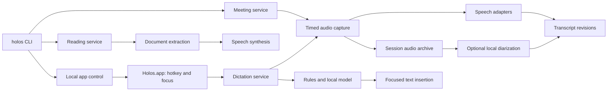

# Holos: design proposal

Draft dated 2026-09-22. This is a proposal for discussion, not an implementation
claim. English first is confirmed. The user will provide Otter and Wispr audio and
text before implementation evaluation. Permission to use downloaded, open-source
models for missing native capabilities remains an open product choice.

## Recommendation

Build one Swift package with shared libraries, a `holos` command, and a small
`Holos.app` background application for dictation. Keep meeting recording and reading
aloud independently usable from the terminal. Subcommands give separate workflows
without duplicating engines; standalone aliases can follow if useful.

Target this Apple Silicon Mac and macOS 27 initially. Most core APIs also exist on
macOS 26, but supporting older systems is a separate decision and test obligation.
Use the installed Swift 6.4 toolchain in Swift 6 language mode.

All speech and language-model inference runs locally. Fetching a requested article
and initially downloading speech/voice/model assets may use the network. An offline
operation with missing assets reports what is missing. It does not choose a server
model. In particular, explicitly use `SystemLanguageModel` for corrections; macOS 27
Foundation Models also exposes remote providers, which are outside this design.

## What the available APIs actually cover

| Need | Proposed implementation | Qualification |
| --- | --- | --- |
| Long recordings and timestamped text | Speech framework: `SpeechAnalyzer` + `SpeechTranscriber` | Designed for conversational and long-form audio; manage model assets and incremental results. [1, 2] |
| Short dictation | Benchmark `SpeechTranscriber` against `DictationTranscriber` | Do not select solely by the class name. Vocabulary customization is specifically documented for `DictationTranscriber`. [3] |
| Microphone audio | AVFoundation / AVAudioEngine | Capture with explicit start/stop and retain timing information. |
| Remote meeting audio | ScreenCaptureKit system/app audio; separate microphone output | Capturing the microphone alone is insufficient when using headphones. ScreenCaptureKit supports both sources. [4] |
| Speaker turns | Separate diarization stage | No public speaker IDs were found in the installed Speech SDK/result API. This is a finding from the inspected surface, not proof of all future Apple capabilities. [2] |
| Natural-language correction decisions | Foundation Models, bounded structured responses | Optional; rules and transcription still work if the model is unavailable. [5] |
| Speech playback and audio export | `AVSpeechSynthesizer` with buffer output | Audition installed voices and test file export per voice. Do not assume availability implies the desired quality. [6] |
| Global hotkey and insertion | AppKit, CoreGraphics events, Accessibility | Behavior depends on the focused application's accessibility support. [7] |
| PDFs and scanned documents | PDFKit text extraction, then Vision OCR | Later input adapters; Vision is not the speech recognizer. |

There is no verified native-only route here to reliable automatic multi-speaker
labeling. A practical optional candidate is FluidAudio's local Swift/Core ML
diarization. Evaluate its offline pipeline and review the chosen code/model
licenses, download size, and memory usage before selecting a version. [8]

Three concepts must stay separate: **transcription** produces words,
**diarization** groups turns as Speaker 1/2/3, and **identification** associates a
speaker with a known person. Renaming a session's speaker is straightforward;
recognizing that person in future sessions needs an additional opt-in enrollment
and matching feature. Foundation Models cannot infer reliable speaker identity
from transcript prose. Holos now has that feature, opt-in and limited to
confirmed labels (see "Voice profiles" below).

### Observed on this Mac

Read-only checks on 2026-09-22 found:

- macOS 27.0, build 26A428; arm64; Swift 6.4; Command Line Tools SDK available.
- `SystemLanguageModel.default.availability == .available`.
- The model reports an **8,192-token** context window. Query this at runtime;
  older documentation describing 4,096 tokens must not become a fixed constant.
- Both transcribers advertise English locales including `en_CA` and `en_US`.
- The checked `SpeechTranscriber` configuration for `en_CA` reports asset status
  `.supported`, not `.installed`. Setup must verify/install the required assets.
- `AVSpeechSynthesisVoice.speechVoices()` reports 187 entries, including English
  entries of enhanced quality. No synthesis or export quality was tested.
- For a possible later Ukrainian milestone, `DictationTranscriber` advertises
  `uk_UA`; the checked `SpeechTranscriber` and Foundation Models language lists do
  not advertise Ukrainian. Each engine needs its own capability check.

These checks did not record audio, install models, request permissions, or assess
recognition quality. The public Speech interface contains timestamps, alternatives,
and confidence attributes, but no speaker identifier was found.

## User-facing tools

The command spelling is provisional. `record start` is foreground by default;
Ctrl-C stops capture, flushes the recording, and finalizes pending text. The same
session can be stopped from another terminal using its printed ID.

```sh
holos doctor
holos setup --locale en-CA

holos dictate enable                 # start the background app
holos dictate disable
holos corrections add "whisper flow" "Wispr Flow"
holos corrections list

holos record start --name "Planning" --source mic+system
holos record status
holos record stop <session-id>
holos transcribe ./interview.m4a
holos session speakers <session-id>
holos session rename-speaker <session-id> speaker-2 "Alex"
holos session play <session-id> --from 00:12:30
holos session export <session-id> --format markdown

holos say "The build is ready."
printf '%s\n' "Piped text" | holos say
holos say --output greeting.m4a "Hello."
holos read https://example.com/article --play
holos read ./article.md
holos voices list
```

`doctor` checks capabilities without prompting. `setup` explains/downloads required
assets and invokes only permissions needed by the selected feature. Permission
denials should give a useful action and leave unrelated commands working.

### Dictation

Use an accessory/menu-bar application in the user's login session, with an optional
login item and a stable bundle identifier. It owns the hotkey, microphone session,
small non-activating status overlay, and Accessibility integration. A system daemon
is not appropriate for interacting with the logged-in desktop.

On hotkey down, capture the focused application/element/selection and start audio.
Show provisional words only in the overlay. On release, finalize, apply corrections,
revalidate the destination, and insert once. Esc cancels without insertion. The
recognizer may stay warm while enabled, but the microphone is active only while
dictating. Readiness must be visible so initial syllables are not silently lost.

Prefer supported Accessibility text-range insertion. Use paste as a fallback with
careful preservation of clipboard types and change-count checks. Never overwrite
an entire field just because selected-text replacement is unsupported. Clipboard
restoration has a race with asynchronous paste consumers; test it per application,
and offer explicit copy if reliable insertion/restoration cannot be established.

Check focus and selection again immediately before writing. If the user switched
fields, retain the result for an explicit paste. Exclude secure/password fields and
respect secure input. Do not synthesize Return or auto-submit. A terminal must not
receive an unexpected trailing newline. "Anywhere" means broad tested coverage,
with a visible copy fallback for unsupported fields.

The first app matrix should include TextEdit, a browser textarea/contenteditable,
VS Code, a terminal, and the user's actual chat/mail applications. The latter list
can be supplied with the Wispr references. The app needs Microphone and
Accessibility. Its hold-to-talk key uses an active CGEvent tap (it consumes the
shortcut), which macOS authorises with Accessibility; Input Monitoring is what
listen-only taps need, so it is not requested. Only if `CGEvent.tapCreate` still
fails with Accessibility granted does the app name Input Monitoring as the fallback
and show it in Settings. Validate under the actual installed app identity, not just
`swift run`.

#### Spoken paths and commands

Settings › Dictation › **Write spoken paths and commands as code** (on by default)
writes "scripts slash restart dash app dot es aytch" as `scripts/restart-app.sh` and
"slash Q C" as `/qc`; **Wrap them in backticks** (on by default) adds the backticks,
never for a terminal (Terminal, iTerm2, Ghostty, WezTerm, kitty, Alacritty, Warp),
which gets the token itself. It is its own step (`SpokenCodeFormatter`), after
learned corrections and before Apple Intelligence's fix, on each committed chunk and
on the rest at release; Run Again runs it with the current settings (without
backticks for a dictation History marks as a terminal's), and History's Fixes line
counts the tokens ("1 spoken path or command as code").

The contract (`SpokenCode`): a code token has no spaces, at least one symbol of
`/ \ . - _ ~ : @ * = + # $ |` and one letter, and parts that are not all function
words (`/the` is "slash the"). Its spoken form is its symbols and parts in order:
each symbol said as its word ("slash", "dot", "dash", "underscore", "tilde",
"backslash", "colon", "at", "star", "equals", "plus", "hash", "dollar", "pipe",
"double dash"; French "barre oblique", "point", "tiret", "tiret bas", "arobase"…) or
written as itself, each part said as its words (up to three joined, accents kept, a
function word only as a whole part: "slash the price" is never `/theprice`), letters spelled
("S. H.", "es aytch", "Q C") or digits said. Only a recognizer's all-capitals run of
four letters or more may be one letter off ("ZHRC" for `zshrc`). The source must say
at least one strong symbol word (below), so "e.g." is never wrapped and "back at noon"
is never `back@noon`; "@" stands only between parts. A span starts and ends at word
boundaries.

Apple's on-device model (greedy, the fix's guardrails, only for chunks with a strong
symbol word: slash, dot, dash, underscore, tilde, backslash) proposes spans in
backticks. The text outside them must be the chunk's own, character for character
but for runs of spaces, or the whole reply is refused; the output takes only the
tokens from the reply. A span whose source does not say its token is read again
without the model with the model's edges (its words and symbol words alternate, no
function word at its edges), or left as said. Words a learned correction produced
stay letter for letter inside any token, each in its place; text already in
backticks stays as it is (the model sees those backticks as quotes). A terminal's
token takes the sentence mark right after it (`cd ~/.config`, not `cd ~/.config.`).
Apple Intelligence's fix then keeps every token as it is, with the characters next to
it (a fix that changes one is dropped); a chunk that ends with a terminal's token gets
no closing punctuation; and the fix gets only what spoken code left of the chunk's
1.5 s. When the model is unavailable, times out,
fails, or its reply is refused, runs that can be read one way are converted on their
own: words joined by strong symbol words within a clause and a line, two symbol
characters at least, standing as in paths and options ("dash dot line" is not
`-.line`), ending with a word; the word before the first symbol belongs to the token
after "dash" or "underscore", not before "dot slash", "tilde" or "dash dash" nor when
it is a function word; a single "slash", "dot" or "backslash" after another word, a
run next to another run, a number word other than a digit's, or a function word at
the end leaves the run as said. While streaming, a trailing run that more words may
continue is held back, from the spelled letters or content word before its first
symbol word, until it ends or the key is released; so is a last content word or run
of spelled letters, which a symbol word may still follow.

### Main window

The app's windows other than the transient ones are one main window, "Voice is Local"
(`MainWindowController`, Sources/HolosApp/MainWindow): an `NSSplitViewController` with a
native source-list sidebar and the selected section's content. Sections: Dictation ›
History (⌘1), Corrections (⌘2); Meetings › Meetings (⌘3), People (⌘4); Listen › Reading
(⌘5, see "Reading section"); Settings (⌘,). A status card at
the sidebar's bottom shows the dictation state and message ("Dictation paused during
meeting recording" while a meeting records). The window is 1280 × 800 by default
(900 × 560 at least), remembers its frame and sidebar width, and opens from the menu's
**Open Voice is Local** (⌘0), from History / Meetings / Settings… there, from the main
menu's Go and Window menus (shown while the window is key), and from every "Setup…"
path (the launch with dictation off, a refused enable, the assistant's "Open Settings").
Each section is a view controller created on first use and kept: Corrections, Meetings,
and People are the former windows' view hierarchies unchanged in behaviour (Meetings
still drives Quick Look through the main window, `PreviewingWindow`; its 2 s refresh and
People's reread run while the section is on screen). Settings is the former Setup window
in cards: General (Open the Voice is Local window when it starts, Appearance),
Permissions (Microphone, Accessibility, System audio, Input Monitoring only
after macOS refused the hotkey tap; each Open Settings click does one thing: a permission not
granted is asked for, which adds Voice is Local to the list (again after its entry was removed)
and lets macOS show its own prompt that leads to System Settings; the page is opened directly
only when no prompt took the focus within 0.8 s, or when the permission is granted, so a click
never shows both), Dictation (on/off, hold-to-talk shortcut, language,
speech model, fillers, Apple Intelligence fix, preview and its opacity), Meetings (record
system audio, speaker labels, a link to People for remembered voices), Reading (default
voice, speed, output folder), History and privacy (Keep dictations, the count, Clear
History…, Keep the audio of dictations and its disk use), and Run Setup Assistant…; it polls
the permissions every second while on screen. The meeting's live transcript is part of
Meetings (see "Live transcript"). The Setup Assistant, the meeting start panel, Review
(Name Speakers), and the dictation preview stay separate windows.

Launch and closing (`MainWindowLaunch`): the first launch opens the Setup Assistant (and
the check after its reopen), and a launch with dictation off opens Settings, as before.
Any other launch opens the main window when Settings › General › **Open the Voice is
Local window when it starts** is on (UserDefaults `openWindowAtLaunch`, on by default):
on Meetings while a meeting records or saves (the app reattached to it), else on the section the
window last showed (`mainWindowLastSection`, saved each time a section other than
Settings comes on screen, since Settings also opens on its own; History when none was
saved or this build does not know it). The window comes forward
like any app's on a manual launch. Closing it never quits
(`applicationShouldTerminateAfterLastWindowClosed` returns false): the menu bar item,
dictation, meeting recordings, and readings keep running, and only Quit in the menu bar
menu or ⌘Q quits. While any of its windows is open the app is a regular one (Dock,
⌘-Tab); a click on the Dock icon brings the main window back, also when another window
(Review) keeps the icon there: restored when minimised, else opened on its last section.

Appearance (`AppearanceChoice`, UserDefaults `appearance`: `system`, `light`, `dark`;
System by default): Settings › General › Appearance sets `NSApp.appearance` at launch
and at once on a change (nil, `.aqua`, `.darkAqua`), so every window follows it: the
main window (with the live transcript), the dictation preview, Review, the Setup
Assistant, the meeting start panel, and alerts. Views draw with semantic colours only (layer colours
are set in `updateLayer`, custom drawing in `draw(_:)`), so they redraw for either.

Keyboard: ⌘1–⌘5 and ⌘, switch sections; ⌘F focuses the section's search field; ↑↓ move
in lists, Return opens (History: the text; Meetings: the live transcript, Review, or the
transcript), ⌫ deletes
after a confirmation (History: the dictation; Meetings: Delete Meeting…; People:
Forget…); in History, Space plays or pauses the selected dictation's audio and ⌘R runs it
again; Tab reaches the sidebar, list, and detail. A key does exactly what its button
does and only while that button is enabled (Meetings: `MeetingActionPolicy`, so ⌫ on a
meeting another process holds only beeps; People: not while a change saves; History:
⇧⌘C only for a dictation the fixes changed, ⌘R only for one with audio and no Run Again
running); Edit › Copy is off with no dictation
selected. Escape keeps `AppKeyboard`'s rule
(it closes the key window unless a field is being edited or a dictation runs). Controls
are standard AppKit controls with semantic colours, so light and dark mode, Full
Keyboard Access, and VoiceOver work without custom handling.

The menu bar menu keeps what is needed without the window: the status line, the
dictation toggle (and Cancel Dictation while one runs), Copy Result / Copy Original /
Discard Result while a result is kept, Correct Last Dictation…, the meeting block, then
Open Voice is Local, History, Meetings, Settings…, About, and Quit. The language and
shortcut submenus moved to Settings.

### Live transcript

The meeting being recorded is the first row of Meetings, its name in bold and its State
"● Recording" in red ("● Paused", "Starting…", or "Saving…" while it is in those
phases; `MeetingOpenPolicy.ordered`, `LiveMeetingPhase`). A meeting recorded by the
`voiceislocal` tool in a terminal counts too. Opening a meeting (double-click, Return, or
the Live Transcript button) follows `MeetingOpenPolicy`: the live transcript while the
meeting records or saves, Review for a labelled meeting, else the transcript preview, as
before. The menu bar's Show Live Transcript… opens the main window on it.

The live transcript (`LiveMeetingViewController`) replaces the list inside Meetings: a
header with ‹ Meetings (also Escape) back to the list (the meeting stays selected), the
meeting's name, and its state (a red dot and the clock while recording; orange while
starting or paused; blue "Saving … — labelling speakers 42%" after the stop; green
"Saved" once done), then the words. One paragraph per turn of a track: a small header
(a blue dot for Mic, purple for System, the track, the session time) over its words.
Words appear as they are spoken: the recorder writes the words live speech has heard but
not finalized (volatile results) to the session's `live.json` at most every 200 ms
(`LiveTextPublisher`, removed when live speech ends), and the view reads it and the
journal's `transcriptFinalized` events four times a second, off the main actor
(`LiveTranscriptReader`, the newest 1,000 segments). Volatile words are drawn in the
secondary label colour and turn into label-coloured text when their final result arrives.
The recorder keeps a volatile copy in `live.json` until its final segment is in the
journal, and the view reads `live.json` before the journal, so words are never missing
from both; a volatile word that starts inside a final segment of its track is already in
it and is left out (words outside every final segment stay, such as an older speech
session's still finishing after a capture restart). While the user is at the bottom (within 24 points) the view follows
the newest words; scrolling up stops that and shows a "Jump to Live" pill at the bottom,
which (like scrolling back down, or End) follows again (`LiveFollow`).

Selecting one finalized phrase while recording enables **Correct Text…** and **Name
Speaker…**. Text corrections appear in the live view at once; safe small mishearing pairs
are also learned in `corrections.json` for later dictations and meetings. Re-editing a
phrase reconciles the rules learned by all live edits: a shared rule remains while any
latest phrase still confirms it, and a matching rule that predated live editing is never
claimed or removed. Both actions are
saved atomically in the session's `live-hints.json`, independently of the recorder-owned
event journal. Post-processing seals the sidecar under the same lock used by writers, so
a late modal save is either included in its final snapshot or refused rather than silently
omitted. Each hint carries the finalized segment ID, track, word range, words, and
session times. After the final/replayed transcript exists, `LiveHintStage` first uses the
ID and words, then the same-track words overlapping or at most one second from those
times, and publishes corrected text before ordinary word fixes and speaker alignment.
The revision's `liveCorrectedFrom`
keeps speaker mapping in the original word space even when its words have no measured
times; automatic fixes retain both that lineage and the live-correction marks. On a retry
after automatic fixes already ran, the hint is first rebased onto their saved unfixed
revision and those fixes are rebuilt on top. After
alignment, a speaker hint names the machine speaker owning those words (or overlapping
that time) before exports. A later Review rename, including clearing a name, wins over a
live hint on later processing runs.

Microphone echo is hidden with post-processing's own rule (`LiveTranscript`, using
`EchoFilter.echoSpans` with `SpeakerAnalysis.alignmentParameters` of the meeting, so only
in a call): a run of at least three microphone words that repeat the system track's words
in order, each starting at most 1 s after (and at most 0.25 s before) its system word, is
left out; a microphone segment with no other word is not shown, and the words left on
either side of an echo are placed at their own times (before and after the system's phrase). Only the words shown take
part (a volatile word a final segment replaced is not heard twice); volatile words of both
tracks do, so an echo disappears as soon as the system track has heard the same
words. The user speaking over the call, a short reply that repeats one or two words, and
microphone words ahead of the system's stay. The first one or two volatile words of an echo
can show until the third makes it a run.

When recording stops, the view stays on the meeting while it saves; once it is saved, the
header offers what opening a finished meeting shows: **Open Review** (Return) for a
labelled meeting, else **Open Transcript**. A meeting whose recorder stopped before it was
saved shows "Interrupted" (orange) and points to Recover…; a failed or damaged one shows
the catalog's state. Going to another meeting from the menu bar while a live transcript is
open brings the list back with that meeting selected. Volatile words cannot be corrected;
their finalized run supplies the durable identity and timing first.

### Reading section

Reading (⌘5, `ReadingPane`) makes the same file as `voiceislocal read` from inside the
app. A **New reading** card holds one field ("Paste a link, or drop a PDF, Word, HTML,
Markdown or text file here") with **Choose File…**, a row with the Voice pop-up and
**▶ Preview**, and a row with the Speed slider and **Make Audio** (Return), so it fits
the section's narrowest width. The field takes an `https://` link with any host (an intranet
name or an IP address included; a bare "example.com/page", which must look like a site, gets
`https://`; `http://` is refused with a hint, as in the CLI), a
`file://` URL, or a path; files are the extensions `DocumentLoader` reads
(`ReadingSourceParser`, HolosContent). Files and links dropped anywhere on the section, or
pasted with ⌘V outside a field, go through the same parser: file URLs first, then web URLs,
then each line of text; one source fills the field, several are all added at once, and the
ones that cannot be read are named under the card.

The Voice pop-up lists "Automatic — best voice for the text's language" and then the
installed voices without the novelty ones (`ReadingVoiceMenu`, HolosSynthesis): those that
speak one of the user's languages first, each group Premium, Enhanced, then default, then
by the user's language order, language, and name; Premium and Enhanced are marked in the
title. Automatic resolves once the text is loaded, as `voiceislocal read` does (the
declared or detected language, `NativeSpeechRenderer.bestVoice`). Preview speaks a
sentence in the voice's language (English for languages without one) with
`AVSpeechSynthesizer.speak`; a second press stops it. Speed is 0.8×–1.4× in steps of 0.1
(`ReadingSpeed`): 1× passes no rate (the renderer's default, as the CLI without
`--rate`), 0.8× is rate 0.42 and 1.4× is 0.6, linear in between. `AVSpeechUtterance`'s
rate scale is not documented as a multiplier, so these anchors are an estimate, not
measured.

Each reading is a `ReadingEntry` (source, title, requested and actual voice, speed, output
path, render cache, state, progress, duration, chapters) in an index,
`Application Support/Holos/ReadingLibrary/library.json` (0600, written atomically;
`ReadingLibraryStore`). An index that cannot be decoded is renamed aside
(`library.json.unreadable-<date>`) and a new list starts; one a newer build wrote (a higher
schema version) is shown exactly as saved: nothing in it is continued, changed, or
deleted, and its rows refuse Try Again, Resume, and Delete (`ReadingLibrary.launchPlan`).
While the list cannot be saved (that case, or an index that could not be read) no new
reading is made: it would leave the list at the next launch and keep its cache with no row
to delete it from. An index not found in a folder that cannot be reached (a support folder,
`HOLOS_SUPPORT_DIR`, on a drive or share that is not connected) is not an empty list: the list
is unavailable, never written, and read again when the section shows or its window comes back
(so is one that could not be read, an I/O error or a permission); nothing is written in its
place. A save writes over only the index the store read or last wrote (by its file identity),
checked and replaced under a lock across processes (`flock` on `.library.lock`; on a volume
without `flock`, a reservation file made exclusively, `.library.reservation`, taken over when
its process ended; saved texts and the launch's sweep take the same lock): one put there since
(another disk mounted at that path, another copy of the app) is kept and the save fails. A
support folder reached through a link counts where the link leads. A saved text is never replaced (an exclusive
rename), and one not found in a folder that cannot be reached is not "none saved". Each
reading keeps the output folder Settings › Reading named when it was added. The index
is read at launch, and every save of it (and the removal of made readings' saved texts after
it) runs off the main actor, one at a time in the order asked; a save a reading must wait for
(Add, Delete's mark, the output chosen before rendering) is awaited, other saves wait while a
Delete's mark is being saved (so none writes a mark whose own save failed), and the quit saves
synchronously, waiting at most 10 s (a folder that does not answer is a failed save, which the
quit says), leaving out an addition whose own save is not known yet. Every save is flushed
(`fsync` of the file, then of its folder) before it counts, and a saved text is placed without
ever replacing one (an exclusive rename, else `ExclusivePublisher`'s exclusive copy). A Delete
whose support drive goes away meanwhile keeps the reading. An index larger than the 64 MiB `load` reads is not saved (the one there
stays), and a save that adds a reading stops at 32 MiB, so a full list can still be changed
and deleted from. A save a quit or crash cut off leaves a `.<name>.<UUID>.tmp`
temporary: the launch removes the index's and the saved texts', and Delete removes its
reading's. Document paths, typed or dropped, keep their spelling too; they are looked up off
the main actor (a drag passing over is judged from what the pasteboard offers alone).
The loaded document is saved beside it (`Documents/<id>.json`) before anything is
rendered, and kept until the reading is made, so Resume and Try Again read the same text
without fetching the page again; a document that cannot be saved, or a saved one that
cannot be read back, fails the reading rather than loading the source again.

`ReadingController` (HolosApp) runs the readings one at a time through
`ReadingWorkQueue` (HolosContent): first come, first made; Stop takes a waiting one out at
once and cancels a running one, which ends as stopped unless it finished anyway. The work
loads the source (`DocumentLoader`, or `WebArticleExtractor`'s offscreen web view on the
main thread), fixes the voice, picks the output (`<folder>/<Title>.m4a`, "Title 2.m4a"…
when the name is on disk or taken by another reading in the list; `ReadingLibrary.outputURL`),
and renders with `ReadingPipeline` in this process into the pipeline's cache in
`Application Support/Holos/Readings/Output-<hash>` (the explicit-output cache of
`voiceislocal read -o`), resuming it when it exists. The chosen output and cache are saved
in the index before rendering starts; a save that fails stops the reading. The pipeline reports progress
(`ReadingRenderProgress`: each part as it starts, then the join) to the row. The pipeline is
main-actor isolated, so it runs as a task on the main actor: speech synthesis and AAC
encoding happen on AVFoundation's threads, and a document file is loaded and every part and
finished file is hashed on a detached task (`DocumentLoader` uses none of AppKit's
main-thread-only HTML importer), so the window stays responsive; a web page is extracted on
the main thread, which `WKWebView` requires. The output and cache are chosen off the main
actor too (`ReadingLibrary.location`); the render's start (locations checked, lock and
reservation taken, cache made or its manifest read: `ReadingPipeline.prepare`), its manifest
saves, and its part-file moves run there; and the finished file is published there (on a volume
without an exclusive rename, the copy into place is written and flushed there, its identity
saved in the manifest first; a copy whose removal cannot be confirmed, because the place it is
moved aside to is taken or its drive went away, keeps that identity) and the part files
removed. What is left on the main actor is releasing the lock and the reservation and removing
the run's joined file when it ends. A Stop reaches every checksum
between its 1 MiB chunks, and a resume stopped while it checks a finished file ends stopped,
never made. Delete's checks and removals run on a detached
task too, while the entry stays saved marked for deletion (hidden). A new reading is queued
only once the index saving it succeeds, and its output is recorded as the path the pipeline
writes (links in the folder resolved); a manifest that names the file through another path
still counts when both name the same file (`ReadingPathIdentity`). A new name is compared with
the other readings' outputs through their folders' links resolved, and a name whose render
cache another reading holds (the same text and settings reach the same cache through the
same file) is never used, so two readings never share, or delete, one file.

Rows show the title and the source (the site without "www.", or the file's name), then:
waiting (Stop); loading or "Rendering part N of M" with a bar (Stop); joining; made
(length · chapters · size · voice, and the speed when not 1×) with **▶ Play** (an
`AVAudioPlayer` in the app, Space or double-click, one reading at a time, position shown;
stopped when the window closes), **Share…** (`NSSharingServicePicker`, ⇧⌘S), **Show in
Finder**, **Delete…**; failed (the error, **Try Again**); stopped (where, **Resume**). A
made reading whose file is no longer there, or was replaced by another file (its file
identity, saved when it was made, differs), says so and offers only Delete; Play, Share…,
and Show in Finder use only that same file (Play reads the file opened and checked, through /dev/fd; Share… hands over a clone or copy made from it). A file's identity is its
volume's UUID where it has one (else its device number), its file ID, and its creation time:
a file whose identity is not the recorded one (a share mounted again gets a new device
number), or one made where its identity could not be read, is read once, off the main actor,
and when its checksum is the reading's its identity is recorded anew; meanwhile the row says
"Checking its file…". Rows show only what the last check of the files found
(`ReadingController.refreshFiles`, `ReadingLibrary.fileStatus`, off the main actor, at
launch, after a reading is made, and when the section shows or its window comes back):
nothing is looked up while a row is drawn or the player's position ticks, and Play and
Share… open the file off the main actor; a FIFO or device put at a reading's path (or at its
index, saved text, manifest, or a document to read) is refused at once, never waited on.
Playback that fails (a file that cannot be decoded, or that does not continue after a pause)
says so; a Play whose file opens slowly is dropped when another Play, a Pause, or a Stop comes
first. A file whose checksum cannot be read, or that changed while it was read, is shown
unavailable and read again at the next check (a file is read once per version: its identity,
size, and last change). One whose folder cannot be reached says
"Unavailable — the drive or share “<name>” is not connected" (`ReadingOutput.unreachableReason`:
a path in `/Volumes/<name>` with no volume mounted there, an empty leftover mount folder
included, or an automounted share not mounted), and Delete keeps its row, cache, and saved
text until the drive is back and the file can be looked for: not found is "gone" only where
its folder can be reached. A drop of things that cannot be read is taken
so its reason shows under the card. Delete (⌫, with a
confirmation) first saves the entry marked for deletion (`deletePending`, hidden from the
list), stops it if it is being made, then moves the reading's finished file to the Trash
(only when its SHA-256 matches the one saved at completion or in the cache's manifest: a
file put at that path since, or the file edited in place, is left alone, and Delete says so; the file is first moved into a private
`.holos-delete-<UUID>` folder beside it under its own name and checked there, so the file
trashed is the file checked, and one that no longer matches goes back;
`ReadingLibrary.trashVerified`), removes a copy a crash cut off (the manifest's
`publishing` identity, never for a made reading, whose copy was finished: its file edited in
place keeps that identity; nor for a file with that identity as large as the finished file,
whose size the manifest saves with its checksum (`outputSize`): a crash after the copy was
done, then an edit; a Delete moves a partly written file to the Trash too, in case it was
that file shortened; `ReadingLibrary.ownership`) the same way (moved into a private
`.holos-delete-…` folder, its identity checked there, then removed; every removal that
depends on which file is at a path, the pipeline's and `ExclusivePublisher`'s included,
goes through `ExclusivePublisher.removeVerified`; a file goes back only by an exclusive rename
or a hard link, never over a file put there meanwhile, and one that cannot go back stays
aside, its place saved with the entry, `outputAside`, for the next Delete; a reading's
Delete moves its file to `.holos-delete-<entry ID>`, so one a quit or crash cut off after
the move finds it there next time; a render removes its own partly written file through
`.holos-delete-<cache key>.publish`, and keeps that file's identity in the manifest until the
removal is confirmed, so the next resume or Delete finishes one a crash cut off (a joined
file's copy goes through `.holos-delete-<join name>`, which the same sweeps find); Delete also
removes the joined files a cut-off render left beside the output, and keeps the reading while
that folder cannot be reached and its render got to joining; all of it holds the cache's render lock, so a
`voiceislocal read --resume` of the same cache keeps the reading until it ends), removes the render cache only when it is
an `Output-<16 hex>` folder directly in the Readings cache folder, and removes the saved
text; only then does the entry leave the index. A made reading is saved as made before its
saved text is removed. A file that cannot be
removed brings the row back with the reason, to delete again; a quit or crash in between is
finished at the next launch.

Files go to `~/Music/Voice is Local/Readings` unless Settings › Reading names another
folder: a folder the user sees in Finder, outside Documents and Desktop, which iCloud
Drive's "Desktop & Documents Folders" would upload. The default folder is created when
missing; a chosen one is not (its disk may be disconnected, and creating the path would
write to the startup disk), so the reading fails asking to connect it or choose another.
Documents dropped or chosen are the files `DocumentLoader` reads, RTFD packages included.
Nothing is uploaded; the only network access is loading the page the user pasted.

Quitting while a reading is made or waits asks: **Keep Rendering** (quit now; the index
marks those readings, and the next launch queues them again, the one being made first),
**Stop** (they are saved as stopped, with Resume), or Cancel; while the index cannot be
saved (unreadable, a newer build's, or its last save failed) only Stop and Cancel are
offered, and a Keep Rendering whose save fails cancels the quit (the readings go on) and says so. A
Stop whose save fails cancels the quit (the saved list may still ask the next launch to
continue the reading) and says why; with nothing rendering, a quit first saves again a list
whose last save failed, and asks Quit Anyway or Cancel when it still cannot. The saved text
of a made reading is removed after each save that works (and at launch), so one kept by a
failed save or removal goes later. The output folder and each file's path are kept spelled
as chosen (`ReadingOutput.fileURL(keepingSpelling:)`), so an NFC name on a share that keeps
NFC and NFD apart is the folder the user picked. Playback stops when the playing reading's
file is moved, deleted, or replaced. A deletion waiting
for a render the quit stopped finishes once that render ends if the quit is cancelled
(`ReadingWorkQueue.onAbandonedEnd`). The render in progress is
cancelled either way; the pipeline's next run removes what that leaves. A reading found
waiting or being made at launch without that mark (the app crashed or was killed) shows as
stopped, with Resume. When the quit is cancelled after that question, at once (a meeting's
question answered Cancel) or later (a meeting that could not be stopped,
`waitBeforeQuitting`), the kept readings continue at once (`quitCancelled`).

### Dictation history

Each finished dictation that produced text is recorded (`DictationRecord`, HolosCore):
its utterance ID, time, the target app's display name (the typed-into app for keystroke
targets, else the owner of the Accessibility target or the frontmost app at key-down,
through `NSRunningApplication`), the locale, the text as written (or as offered for Copy
when it could not be written), the recognizer's text before filler removal, corrections,
and Apple Intelligence, the fixes (fillers removed, corrections applied, words the
on-device fix changed, counted with `WordDiff`), the outcome (inserted, typed, needsCopy,
unverified, targetChanged, partly written or not, with the reason), for a partly written
one the rest exactly as Copy Result offered it (`unwritten`, with its leading space;
History's Copy copies it, and the detail shows it under the whole text), the seconds from
Listening to release, and the word count. Every way a dictation ends builds its record by
one rule (`DictationRecord.endText`, `Outcome.afterFailure`): a failed dictation that had
recognized words keeps the text as written or offered, with Apple Intelligence's fix and
its changed-word count, and the outcome the stream left (unverified after an unconfirmed
write, targetChanged after the app or field changed, else not inserted; partly written
when a prefix went in); a cancelled one, one that recognized nothing, and one
refused at key-down (a secure or password field, secure input on) are not: the draft a
record is made from exists only after the key-down checks passed, and nothing is
recorded while secure input is on at the end either.

Storage (`DictationHistoryStore`, HolosStorage): `<supportRoot>/History/dictations.jsonl`
(Application Support/Holos unless `HOLOS_SUPPORT_DIR` is set), one compact JSON line per
dictation appended with `AtomicFile.append` (0600, folder 0700). Reads stream the file a
line at a time, so a Forever history of any size stays readable; a line longer than 8 MiB
(or damaged, or torn by an append in progress) is skipped, never the whole file. Deleting
one, Clear History, and the retention sweep rewrite the file atomically; every sweep,
Forever and Off included, also drops lines that cannot be read. A line of a later schema
version (a newer Voice is Local) is not shown but is kept byte for byte by every rewrite
(the retention sweep removes it only when it can read its date and it is past the cutoff;
Clear History removes it), so opening the history with an older build loses nothing; such
lines count as kept (History and Settings say so, and Clear History and History Off's
offer stay available). A history file that cannot be read is reported (footer, status,
Settings), never shown as an empty history, and Clear History stays available (a Clear
that succeeds makes it readable and empty again). History and Settings read the file again
whenever they come on screen or the window becomes key, so a `voiceislocal history clear`
run meanwhile shows at once. Writes hold
`dictations.lock` (flock), so the app and `voiceislocal history clear --yes` never
interleave. The app (`DictationHistoryService`, HolosStorage) runs every file operation on
one serial queue off the main actor, keeps the records in memory for the History section,
applies changes made while a reload reads the file to what it read (a dictation finished
during the launch load is merged, not lost), and waits for the queue (at most 5 seconds)
when it quits, so a dictation just recorded, deleted, or cleared reaches the file. A change
shows at once; when its write then fails (a full disk, a folder that cannot be written),
the History footer and the status message say so ("The dictation could not be deleted;
it is still kept on this Mac.") and the records are read again from the file, so a failed
delete or clear shows its dictations again and a failed append is not shown as kept. Once
a later write succeeds, the footer and the status message stop reporting the failure. A
final transcript that comes back empty after text was written while the user spoke is
still recorded, as unverified, with the text written (or its fixed form).
Turning History Off offers to clear what is kept once the history has been read, so an Off
chosen before the launch load finished still counts the dictations on disk.
Retention is UserDefaults `historyRetention`: `off`, `7`, `30` (the default), or
`forever`, swept at launch, once a day, and when it changes. Off stops recording and
offers to clear what is kept. The text never goes to `os.Logger`, and the clipboard is
touched only by the user's Copy or Copy As Heard (History) and Copy Result / Copy
Original (menu). History's Correct… opens Corrections with that dictation: the last one
is compared with its text as recognized, as before; an older one with its text as
written, the only form History keeps. Corrections knows which dictation it holds by ID,
so learning from an older one never replaces what Correct Last Dictation opens, even
when the two have the same text.

### Dictation audio and Run Again

History can keep each recorded dictation's microphone audio, so a change to the corrections,
the language, filler removal, or Apple Intelligence's fix can be tried on what was really
said. Settings › History and privacy › **Keep the audio of dictations (for Run Again)**
(UserDefaults `historyKeepAudio`, on unless turned off) shows what the audio takes on disk;
turning it off stops keeping new audio and offers to delete the audio already kept (the text
stays). History Off keeps no audio either.

Capture: `DictationController.frameTap` hands the app every microphone frame the recognizer
took, with its utterance ID, in order and before the result; the app gives them to a
`DictationAudioWriter` (HolosAudio) made at key-down, only once the secure-field checks passed
and only when History records and keeps audio. The writer converts and encodes on its own
queue (AAC, mono, 16 kHz, about 32 kbit/s; roughly 4 KB a second plus a 25 KB container)
into `<supportRoot>/History/audio/<id>.partial.m4a` (0600, folder 0700), made on the first
frame. When the dictation's History record is added, the history queue finishes the file
and, holding `dictations.lock`, renames it to `audio/<id>.m4a` and appends the record, which
links it (`audio: {file, seconds}`; an optional field, so the schema stays 1 and older builds
read the line). A dictation History does not record (cancelled, refused at key-down, nothing
recognized, History or the audio setting off, secure input on at the end) deletes its
partial file. Audio that cannot be finished or moved is deleted and the record kept without
it.

Retention follows the text: Delete removes the dictation's audio, Clear History and
`voiceislocal history clear` remove all of it (but a partial file younger than an hour, a
dictation still in progress), and every retention sweep removes the audio of the records it
removes, audio no kept record links (its record is gone, or an older build rewrote the line
without the link, so nothing could play it), and partial files older than an hour (at
launch, all of them). Audio of a newer build's lines is kept with them. Each of these, and
Delete Audio, first moves the audio aside (`<id>.m4a.removing`), rewrites the file, then
deletes it; a rewrite that fails puts it back, so a failure never leaves a record without
the audio it links. Audio a crash left aside is put back by the next sweep when its record
still links it, else deleted. Update History keeps the audio link the file has. In memory,
the audio link lands once the append finished (`linkAudio`), under the changes made since
(a Delete Audio or an Update History made meanwhile stays), and an Update History whose
record another writer removed meanwhile leaves it removed.

Run Again (History detail, ⌘R; `voiceislocal history rerun`) reads the file back as 0.1 s
frames and feeds them to the recognizer live dictation uses (`AppleSpeechSession`, the
speech backend's progressive preset, the current dictation language, the word list and the
learned corrections' words as contextual strings), then runs the text steps of live dictation
(`DictationTextPipeline`, HolosCore): filler removal and corrections as on the final text,
and, when Apple Intelligence's fix is on and available, the fix as dictation streams it:
each recognizer result is taken as committed in turn (the last one too: the recognizer
commits it when it finishes, before the result) and each new part, cleaned as streaming
cleans it, is fixed as a chunk; what streaming held back (a trailing comma, the start of a
correction) is fixed on release as final; with the same model, sessions, and timeout
(`OnDeviceFix`, HolosDictation, which the app's `DictationFixPipeline` uses too). This is
dictation writing into a field; the live grouping of chunks (those queued while the model
is busy are fixed together) depends on timing, so a fix may differ slightly from the live
one. The comparison (`DictationRerunReport`) shows the
text as heard and as written, then and now, with the words that differ marked; what each
step did now (word changes); and `changedBy`, the steps that behaved differently from then:
the recognizer heard other words; filler removal removed fillers where it did not (in the
words heard now, or replayed on the words heard then); the corrections replaced a different
number of phrases (the same two ways) or, with no other explanation, other words; Apple
Intelligence changed a different number of words. Nothing is typed anywhere and nothing is
copied: **Copy New Result** copies only when chosen, and **Update History…** (after a
confirmation) replaces the record's text, text as heard, fixes, and language, keeping its
date, app, outcome, and audio. The player row plays the file (▶/⏸, position; Space with the
list focused) and stops when another dictation is selected or History leaves the screen.

`voiceislocal history rerun <id|latest> [--json] [--no-ai-fix] [--language xx-YY]` prints
the same comparison; `--all [--since 7d] [--json]` runs every dictation with audio and
reports, per dictation, whether the text changed and `changedBy`, with a summary per step,
to judge a change on the user's real dictations. The command reads the history, the
corrections file (Application Support/Holos/corrections.json), the word list (words.json),
and the app's saved settings
(its defaults domain `ca.orlenko.holos.app`: `dictationLocale`, `removeFillers`,
`aiFixMisheard`); it writes nothing. The recognizer needs the language's speech model
installed for the process running it.

### First-launch setup

A first launch opens the Setup Assistant, one page at a time, ordered so the app
reopens at most once: (1) Welcome, with Start or "Skip — Show All Settings" (Settings in
the main window); (2) the dictation language and the microphone, both in-app (macOS's own
prompt), plus "Also set up meetings", checked by default; leaving this page starts the
speech model download and, for meetings, the speaker models, which continue in the
background; (3) Accessibility, granted in System Settings and effective at once: the
page polls `AXIsProcessTrusted()` and explains removing and re-adding a stale entry;
(4) the permissions that take effect only after a reopen, grouped: Screen & System
Audio Recording (optional; without it meetings record the microphone only) and, only
when the hotkey tap was refused with Accessibility on, Input Monitoring. The user is
told to choose Later when macOS offers Quit & Reopen. Since
`CGPreflightScreenCaptureAccess()` usually reports true only after reopening, the
request counts, not the reported state; (5) Finish re-checks everything. When a
reopen-requiring permission was requested, its button reopens the app through the
normal quit (a recording meeting still asks first; a cancelled quit does not reopen):
a detached `/bin/sh` waits for the process to exit, then `open`s the bundle, and the
next launch shows the check page once. Dictation turns on when Microphone,
Accessibility and the speech model allow it, or when the download ends; when the
hotkey tap was refused, Input Monitoring is a prerequisite too: requested this run,
enabling waits for the reopen (the check page reports the outcome), otherwise
dictation stays off. Waiting for the download survives a quit and the reopen
(`setupAssistantEnableAfterSpeechModel`): the next launch resumes the install and
turns dictation on when it ends. A speaker-model install the assistant started and
that had not ended (`setupAssistantSpeakerModelsPending`) is resumed at launch too,
after the detached earlier run, which still holds the install lock, exits.

`SetupAssistantFlow` (HolosCore) holds these decisions and is unit-tested. UserDefaults
`setupAssistantDone` is absent before the assistant ever ran, false once it started,
true once finished or skipped; `setupAssistantAwaitingReopenCheck` asks for the check
page. An install from before the assistant (dictation on, or Microphone and
Accessibility granted) is marked done silently. Closing the window keeps the progress
for that run; the next launch shows the assistant again until it is finished.

### Learning corrections

Maintain a local database of vocabulary, explicit substitutions, and confirmed
examples. This is memory and retrieval, not automatic fine-tuning of Apple's model.

1. Apply confirmed, scoped rules with token/phrase boundaries and deterministic
   precedence. Scope by locale and optionally application/domain.
2. When supported by the chosen recognizer, pass a small relevant vocabulary set.
   Apple's documented contextual-string support is for `DictationTranscriber`;
   do not assume it also biases `SpeechTranscriber`. [3]
3. For an ambiguous candidate, ask the local language model to select among known
   replacements or leave unchanged. Validate the selected edit in code.
4. Keep the raw transcript and the applied edit record. Never allow a correction
   pass to invent a new sentence or rewrite unrelated names, amounts, or negation.

Start with an explicit "correct last dictation" action: select the corrected text,
invoke the action, and review the extracted correction. Subsequently, offer an
opt-in observer restricted to the recently inserted span in the same field. Expire
it after a short window, focus change, or unrelated editing. Accessibility does not
provide reliable general-purpose edit tracking in every app; uncertain diffs become
suggestions, not permanent rules. Edits may reflect changed intent, not recognition
mistakes. Do not learn from ordinary typing elsewhere.

The opt-in misheard-word fix (`TranscriptFixer`) shows Apple's on-device model only
the learned pairs whose whole heard phrase is in the chunk, word for word and in
order, with no sentence or clause mark, line break, bracket, quote or path symbol
("/", "@", "#") between its words, and an opening quote never taken for a closing one: its function words exactly, and each content word (not a function word of the
language dictated, English or French, and at least three letters) as is or, where the
chunk's word is not a real word, misheard again a little differently (the same
pronunciation key and half the letters the same: "a bundu" says "a Bundo"; "a point",
"a band" and "bulk request" for "bull request" do not, nor "bat" for "bit"). Sharing a
word like "a" or "on", part of the phrase, or a word of the meant side does not count:
listed that way, "a Bundo -> ubuntu" and "Onobunto -> on Ubuntu" made the model turn
"on a Windows machine" into "on a Ubuntu machine". Each text word is compared once with
each distinct heard word, and the choice and the guard run inside the fix's time limit.

The guard's contract is narrow on purpose: the fix must never change what was said,
and refusing a good fix costs less than letting one change the meaning. It accepts
only the chunk with some misheard words replaced one for one, the words lined up in
order with the same count, and nothing else:

1. A learned pair spelled exactly where its heard phrase was said, words and marks
   ("Onobunto" becomes "on Ubuntu", "common free" "comment-free", "slash QC" "/qc");
   the pair's words are then frozen, so no further change reaches them, not even a
   homophone of them.
2. A word the dictation language does not know ("bundu", "timux", "semicolen")
   replaced by one real word said alike (the same letters, the same pronunciation key
   with silent letters dropped, or the same rough consonants with half the letters the
   same), never by its opposite through a prefix ("unencripted" is not "encrypted").
3. A real word replaced by a listed homophone of the language ("their", "there" and
   "they're", "right" and "write", "one" and "won", "by" and "buy", "pears" and
   "pairs"; "ces" and "ses", "a" and "à", "peut" and "peux", "contes" and "comptes").
   Accents count: "pécher" is not "pêcher".
4. Commas and apostrophes between words, closing marks at the very end (not inside a
   closing quote or bracket: "“go.”" does not become "“go”."), and the capital that
   starts a sentence (and the pronoun "I").

A word is real when the system spell checker knows it in the dictation language
(lowercased or capitalized, so names such as "Mary" count), when it has a digit, or
when it is a word of a meant phrase the speaker taught or of a word-list term (see
"Word list"). Everything else is refused:
another real word however alike it sounds ("bat" and "bit", "want" and "wanted",
"tooth" and "teeth", "no" and "none"); a word added, dropped, split, joined or moved,
so articles ("a elephant" stays, as "to store" does), contractions ("do not" and
"don't"), repetitions ("vous vous") and hesitations stay as said; numbers written
another way ("ten" and "10", "1,000" and "1000", "quatre-vingt-dix-huit" and "98"); a
case change inside a sentence ("us" and "US", "windows" and "Windows"); any change to a
word in a unit, number, address, path, tag, option or identifier ("5 mW",
"team@right.com", "/tmp/site.py", "#right", "--right", "GitHub"); a name (a capitalized word, sentence starts included, but
"I", function words, hesitations such as "Hmm", words under three letters and guarded
words), which may change only in its apostrophes ("Jai" and "J'ai"); a comma between two
numbers coming or going ("1,5" and "1 5"); any other mark added, removed or moved; more
than 2 replaced words, or 20 %. Every change also keeps the word's negation, modal,
auxiliary, unit, quantity, person and number ("can" is not "can't", "He" not "She",
"Ship 10 units" not "Ship 100 units"). Words a learned correction produced stay, each
where it was. Function words and homophones are those of the language dictated
(English or French). Without a spell checker dictionary for the language, every word
counts as real.

The spell checker runs in another process and a call may stall, so the fixer asks it
about the chunk's words, and then the reply's, on its own serial queue, waiting at most
250 ms each time; a word it did not reach counts as real. The model runs with the
`permissiveContentTransformations` guardrails: with the defaults about half the fixes in
a day's log failed in about 200 ms, ordinary sentences refused as "May contain unsafe
content". A refusal that still happens leaves the chunk as recognized. The recognizer's
contextual strings are the word list's terms, then the content words of the meant
phrases, once each ignoring case ("on Ubuntu" and "ubuntu" give one "Ubuntu").

### Word list

A correction needs a misheard side, so a term the recognizer gets wrong in ways not
yet seen ("Keycloak", "AtmoSys", "Urban Sky") had no place to go. The word list is
that place: terms the recognizer should expect (names, products, jargon), kept in
`Application Support/Holos/words.json`:

```json
{ "schemaVersion": 1,
  "entries": [ { "text": "Urban Sky", "addedAt": "2026-09-29T14:02:11Z", "source": "user" },
               { "text": "Claude", "addedAt": "2026-09-30T09:12:40Z", "source": "user",
                 "heardAs": [ "cloud", "clot", "clod" ] } ] }
```

- A term keeps the case it was written in and may be several words; whitespace is
  collapsed. Two terms that differ only in case or spacing are one term, spelled as it
  was first added. At most 1,000 terms of at most 100 characters. `source` is `user`
  (the Corrections section, `voiceislocal words`) or `review` (a meeting's Review, for
  later); an unknown value from a newer version is kept as written.
- The file is written whole and atomically (0600). Every change is made under an
  exclusive lock (`words.json.lock`) on the list as it is on disk then, so the app and
  the CLI never lose each other's changes. A damaged file, or one with a newer schema
  version, is refused and never overwritten: the list is then empty for recognition
  and the Corrections section says why.
- The recognizer's contextual strings (`RecognizerVocabulary`) are the word list's terms
  as written (whole phrases: contextual strings take phrases), then, for dictation, the
  content words of learned corrections; for a meeting, people's names and then those
  correction words. Each string once, ignoring case and spacing, the first spelling kept,
  at most 100 in all. `AnalysisContext.contextualStrings` (SpeechAnalyzer) documents no
  limit; `SFSpeechRecognitionRequest.contextualStrings`, the same feature in the older
  API, says to keep the total to 100 phrases. Past 100 the word list, which comes
  first, crowds out the rest; `voiceislocal words` says so. Names come before
  correction words so a long correction list never pushes the meeting's people out.
- Dictation: the app reads `words.json` at launch and again whenever the file changed
  (its inode, size, modification or status-change time), or could not be read last time
  (checked at each dictation, meeting start, Run Again, and when the Corrections section
  shows or the window comes back from Terminal), and sets the next dictation's
  contextual strings, as a correction does. A dictation already listening keeps the
  strings it started with. Run Again and `voiceislocal history rerun` use today's list.
- Meetings: the list is part of the vocabulary handed to the recorder at start and
  saved in the meeting as `vocabulary.json` (§4.12 of meeting-design.md). Replays,
  rebuilds and `session languages` use that saved vocabulary, never today's list: it is
  part of what makes a meeting's transcript reproducible. `voiceislocal session recover
  --current-vocabulary` is the one way to ask for today's list (with names and
  corrections) instead, for the audio that run transcribes again; `vocabulary.json` is
  not rewritten, so a later rebuild without the flag replays as the recording heard.
  Speakers are then labelled on that rebuilt transcript as it is: the languages stage,
  which would transcribe a meeting in several languages again with `vocabulary.json`,
  does not run.
  `session languages` has no such flag: its transcriptions are reused across runs,
  and a different vocabulary would make a reused one and a fresh one disagree.
- Apple Intelligence's fix: the words of each term count as real words for the guard
  (`Lexicon`), and nothing else about the guard changes. A word the language does not
  know may become a close-sounding word of a term ("keycloack" becomes "keycloak"), and
  a word of a term is never replaced but by a listed homophone or a taught pair. No word
  is split or joined for a term ("key cloak" stays two words), the case of a term is not
  brought into a sentence, and a capitalized name stays as written: a correction is the
  way to teach those.
- **Often heard as.** Some terms come out as real words ("Claude" as "cloud", "clot",
  "clod"), where a correction would be wrong: "cloud" is often meant. A term may list such
  words (`heardAs`, at most 20, each at most 100 characters with a letter or digit, never
  the term itself, once each ignoring case; left out of the file when there are none, so
  older lists read and write as before, and the schema stays 1: an older build that saves
  the list drops them). They are candidate swaps the on-device model decides from the
  context, never made on their own (`WordList.heardAsPairs`, heard → term; a word heard for
  two terms counts for the last). In dictation, after Apple Intelligence's fix (which is
  never told the pairs, and whose guard still refuses a real word replaced by a term), each
  place in the chunk where such a word was said (whole words, any case; at most 3 per
  chunk, after the base fix is validated) is one separately bounded question to
  the model, as for meetings (`HeardAsJudge`, below, with the chunk as the passage and no
  title); only a reply that is
  exactly the term replaces exactly that place, spelled exactly as listed ("iPhone" stays
  "iPhone" at a sentence start). A question that times out keeps the validated base fix,
  every earlier term choice, and that place as written. A place that overlaps a meant phrase
  of a learned correction is never asked about (the chunk is already corrected, so with "clawed → cloud"
  every "cloud" stays, as the guard keeps it); meetings leave out what the corrections
  changed there. Told the pairs as candidates in the fix's own instructions instead, the
  model put "Claude" in 2 of 3 invented sentences about the cloud; asked this way it kept
  all 3 and put the term in the 2 where a coding assistant was talked to. Meetings:
  "Meeting word fixes" below.
- The Corrections section's "Word list" card lists the terms with a search field and a
  count; the field below adds (Return adds; a paste of several lines adds one term per
  line; a term that could not be added, too long or with the list full or unsaved, stays
  in the field), Remove or ⌫ removes the selected terms. Its "Often heard as" column is
  edited in place (double-click, comma-separated, saved when the field is left); the
  search finds those words too. `voiceislocal words list|add <term>… [--heard-as a,b]|
  remove <term>…|import <file>|heard-as [<term>] [--add a,b] [--remove a,b]` does the same
  from Terminal (import: one term per line, `-` for standard input; `--heard-as` with one
  term, added to those a listed term has). Nothing is added automatically.

LLM decisions have a bounded latency budget. On timeout, refusal, unsupported
language, model unavailability, or invalid output, use deterministic rules plus
the transcript. A valid structured response is not evidence that the edit is right.
General prose polishing can be a separate opt-in feature after correctness is measured.

### Meeting word fixes

Meetings use a lot of jargon the recognizer misses, and contextual strings barely help (on a
real meeting, term hits went from 30 of 82 to 32 of 82 with the word list). Learned
corrections used to reach dictation only. The post-processor's stage 1d `wordFixes`
(`WordFixStage`, after the languages stage and before the speakers, so speakers are
labelled on the fixed text) applies them to meetings, and the word list's "often heard as"
words with the on-device model:

1. *Corrections.* Every segment gets the learned corrections as dictation applies them
   (`CorrectionList.matches`: whole words and phrases, any case and spacing, the longest
   heard phrase first, a sentence's capital carried over unless the saved heard phrase
   has one). Deterministic.
2. *Often heard as.* Each place where a term's heard word is written (matched the same way,
   outside what the corrections changed) is one question to Apple's on-device model
   (`HeardAsJudge`; `SystemLanguageModel` with the fix's permissive guardrails, greedy, a
   fresh session per question, 10 s each, at most 500 places per run, one after another in
   the background): the passage (the segment with the place marked `[[cloud]]`, at most 300
   characters before and 200 after; for a segment of fewer than 8 words also the end of
   the segment before it in time and the start of the next, any track, 120 characters
   each), the meeting's title, and "At [[cloud]], did the speaker say "cloud" or
   "Claude"?". Only a reply that is exactly the term (ignoring case and the spaces, quotes
   and marks around it) replaces that place, by the term as listed; any other complete reply
   keeps it. An error or a time-out keeps the current fixed revision on a rerun, rather than
   taking an unanswered place for a rejection and undoing a term chosen before. On invented
   sentences: asked yes or no, the model answered
   no every time; asked to choose, it never put the term where it was not meant (single
   sentences: 13 of 15 right; the stage's own path on a 10-sentence invented meeting: the
   cloud kept in all 4 places it was meant, "Claude" in 3 of the 6 where it was, the misses
   being "The cloud code session…", "Cloud wrote most of this function…" and "Let's ask
   cloud to summarize…"). Given the neighbouring sentences of that meeting (alternating
   topics) for every place, it found "Claude" in 2 of 6 and once put it where it was not,
   which is why neighbours come only with short segments. It runs only with "Fix misheard words with Apple Intelligence" on
   (`DictationPreferences.aiFix`, read from the app's defaults domain) and the model usable
   for the place's language (English and French, as for dictation); otherwise only the
   corrections are made and the stage says why.
3. *Timings.* A replaced phrase takes the time span of the whole words it touched, its new
   words share that span evenly (lowest confidence of the replaced words), every other word
   keeps its time, and offsets are rebuilt for the new text (`WordFixes`). Segment IDs,
   starts and ends stay, so turns and exports find their segments. A segment whose word
   offsets do not fit its text is left alone.
4. *Versions.* The result is a new revision with `fixedFrom` naming the one it was fixed
   from (kept), each change marked on its segment (`fixes`: the effective words, what was
   heard, `correction` or `term`), journaled as `wordsFixed {transcriptID, base,
   corrections, terms, asked}` before it is saved as current (under the writer and speaker
   locks, as the languages stage publishes). Fixes are always made from the transcript
   before any fix: the same corrections and terms keep the current transcript ("The words
   were already fixed"), changed ones make a new revision from that base, and none left
   undo the fixes in a new revision. A fixed transcript stands for its base in every
   bookkeeping that names transcripts by ID (`WordFixStage.unfixedID`: a merge's
   `languagesDetected`, a rebuild's events, `recordedTranscriptID`,
   `leftAudioUntranscribed`), so the languages stage and Recover treat it as the transcript
   it was fixed from.
5. *When it runs.* After every recording, import and recovery (stage 1d of each run), and
   on request: Label Speakers and `session diarize` (with today's corrections and terms),
   and `voiceislocal session fix-words <session> [--force]`, which records the stage even
   with nothing to fix and keeps the speaker labels when the transcript does not change.
   Nothing is recorded without corrections, terms with heard-as words, or an earlier fix.
   The review window's relabels (`--keep-transcript`) never run it. Automatic processing
   leaves a transcript with edited speaker labels alone. A named, unforced `fix-words`
   instead creates an immutable run for the new transcript, maps every machine turn by word
   timing (or by each fix's original-word provenance for an untimed segment, whose estimated
   times move when its word count changes), and replays the effective edit journal (including splits, assignments, merges,
   names, links, rejections and enrollment exclusions); it does not diarize again. `--force`
   labels speakers again instead (names carry over). Without the model,
   a transcript whose terms the model chose before is kept rather than undone. The same is
   true when any term question fails, times out, is skipped after three consecutive timeouts,
   or lies past the 500-question limit: an incomplete rerun publishes no replacement. A
   cancellation before publication publishes nothing; once the mapped head is published,
   exports catch up before cancellation is honoured. A corrections.json or words.json that
   cannot be read keeps the transcript and makes the record partial.
6. *Review.* Each fixed word is underlined with dots in the review window; its tooltip and
   its VoiceOver actions say what was heard and whether a correction or a word-list term
   made it. Its contextual menu and VoiceOver offer **Revert to “…”**. Reverting makes a new
   transcript revision with only that visible mark removed and its original words restored, maps
   the current immutable speaker run to the new word positions, and replays its effective
   edit journal without diarizing; other word fixes and speaker edits stay. A hidden
   `reviewRevert` mark protects that decision from automatic word-fix passes (including Label
   Speakers); an explicitly requested `session fix-words` checks all words again. If the
   transcript pointer is saved but publishing its mapped speaker head fails, Review retries
   that publication from the still-current old head; a later automatic pass does the same
   before it may relabel or export.
7. *Evaluation.* `eval apply --add-vocabulary`: where a reviewed passage replaced local
   real words by a term of the word list or a marked one (local "cloud", cloud "Claude"),
   the pair, without the neighbour a correction is learned with, is proposed and added as
   an often-heard-as word of that term instead of a correction; a pair with a word that is
   not a real word stays a correction. The longest listed term in the meant side is found
   first ("cloud code" → "Claude Code" with only "Claude Code" listed), and a term's own
   marks tell terms apart ("C#", "C++", ".NET"); the model's reply is compared the same way.
8. *Recovery and journaled languages.* Recover counts a failed word-fix stage as unsettled
   (it runs again once the files can be read). Languages asked for by name are journaled
   for the transcript a fixed one stands for, so a later fix keeps answering them.
9. *Known race (shared with the languages stage and `fix-words --force`).* A speaker edit
   saved to the old head while the new transcript's speakers are being labelled is an edit
   of the replaced labels: names carry over, turn-level changes do not (§4.14 step 6).

### Deep transcription after meetings

The live transcript is what Apple's recognizer heard while the meeting ran; it misses
names and jargon (on a 53-minute call, 20.9 % WER against a cloud reference and 31 of 82
word-list terms). Nothing waits for the final transcript, so after the meeting the saved
audio can be transcribed again by a larger local model: Whisper large-v3 turbo through
WhisperKit, on the Neural Engine, prompted with the word list, measured 11–14 % WER and
56–66 of 82 terms on the same call; the pass as built measured 14.6 % and 63 of 82 there. It
takes about 8–11 minutes per hour of audio on an M4 Pro (each chunk is decoded with and without
the prompt).
Everything stays on the Mac; only the one-time model download (about 1.6 GB, from Hugging
Face) uses the network.

- *Model.* `voiceislocal setup --whisper` downloads it into Application Support
  (`Models/whisperkit/`), resuming an interrupted download, and loads it once before it
  counts as installed; `voiceislocal doctor` reports it.
- *The pass.* `voiceislocal session deep-transcribe <session> [--force]` renders each
  track to 16 kHz (long gaps shortened, as for speaker labels), transcribes it in pieces
  with the meeting's language and a prompt made of the meeting's name, the word list and
  people's names (the terms this meeting's vocabulary used first, within the 111 prompt
  tokens WhisperKit keeps), and maps the words back to session time. Whisper's known failures are
  guarded against: a passage over near-silence (below −50 dBFS) where the live transcript
  has no words ("Thank you." in a capture gap) is left out, and so is each repeat of a
  passage written three or more times in a row.
- *Versions and what follows.* The result is a new transcript revision (`engine`
  "whisper:<model>"; the recorded one is kept), journaled as `deepTranscribed`. Live
  corrections, meeting word fixes, speaker labels (names carry over), recognition and the
  exports then run on it as after a recording, including the echo filter of calls. Edited
  speaker labels are respected as the other text-changing stages respect them: the pass
  is skipped with the standard message unless `--force`. A transcript the model already
  made is kept unless `--force`.
- *Languages.* Meetings in several languages are not transcribed again yet: Whisper's
  language detection cannot be limited to the meeting's languages, so the pass says so and
  keeps the merged transcript.
- *In the app.* Settings › Meetings offers the model's download (1.6 GB) and "Deep
  transcription after meetings", off until the model is installed. When on, each meeting in
  one language is queued once it is saved and transcribed again on AC power, one at a time
  (on battery it waits for the power adapter); the queue survives a quit or crash, and an
  interrupted pass starts over. The Meetings list shows "Final transcript queued", "… waits
  for power" or "… in progress…"; a meeting's right-click menu offers Make Final Transcript
  Now (also on battery; it labels speakers again, names carried over) and Cancel Final
  Transcript. Meetings saved while the app was closed are queued when it next opens. One pass
  runs at a time on the Mac: the command holds a lock file for its whole life, and the app
  knows another pass is running (one started before a relaunch or in Terminal) only from that
  lock; it manages only the passes it starts, and waits for any other. A Make Final Transcript
  Now that fails or is incomplete says why in an alert.
- *Evaluation.* `voiceislocal eval local <session> --backend whisper` makes the same
  transcription as a candidate, so `eval compare --local latest` measures it against a
  cloud run without changing the meeting.

docs/meeting-design.md §4.16 has the stage, files, thresholds and measurements.

### Meetings

Record the microphone and remote/system audio into **separate timed tracks**. A
system track can contain several people and other app sounds; it is not a speaker
identity. Prefer an app filter where reliable. Headphones reduce acoustic leakage;
without them, remote speech can occur on both tracks and needs overlap/echo handling.

Treat recorded audio as the recoverable source of truth. Write bounded PCM chunks
to disk independently of transcription. Default chunk duration, e.g. 30 seconds,
must be tested and tunable. Index all chunks on a shared session timeline and keep
format changes, gaps, and discontinuities explicit. Native sample rates may differ;
create a separate normalized stream for each analyzer instead of modifying masters.

Use live text for feedback and offline finalization/reprocessing for the durable
transcript. A slow or failed recognizer must not stall recording: retain a backlog
on disk and mark the unprocessed interval. A full disk or failed writer must surface
as a recording failure, preserving existing material. Rotate/finalize chunks so a
crash risks only the active tail, with recovery behavior measured in the first spike.

Persist stream timestamps against a monotonic session origin. Drift, resampling,
device changes, and sleep/resume need explicit treatment. A switched input device
starts a new format epoch. Record interruptions as gaps; never present missing
audio as uninterrupted speech. Prevent idle sleep during an explicitly active
recording where supported; lid close and system suspension remain interruption cases.

Prefer capturing the meeting application's audio when it can be isolated; exclude
Holos's own playback where supported. Keep remote audio and microphone tracks
separate. With loudspeakers, the microphone can also hear remote voices: this causes
echo/duplicate transcription and must not be mistaken for another speaker. Headsets
are the first supported setup; evaluate echo handling before claiming speakerphone
quality. Source tracks alone distinguish microphone from system output, not all
meeting participants.

After recording, optionally run diarization across the full session. Assign stable
session speaker IDs, with editable display names. Permit unknown and overlapping
speakers; do not force every word into one speaker. Preserve word timing when
splitting a sentence across a speaker turn. Manual rename/split/merge/reassignment
are edits over machine results. Reprocessing creates a new revision and flags
ambiguous transfers of existing human edits instead of silently discarding them.

With strict Apple-only dependencies, ship timestamped text, manual speaker tagging,
and distinguishable source tracks first. Fully automatic multi-speaker labels remain
a requirement for the eventual Otter subset, not something the native baseline
should claim to have solved.

### Text-to-speech

Preserve AITTS's useful interaction patterns: immediate speech from arguments/stdin,
queued playback, long text/URL input, saved source, and resumable rendering. Use a
per-user playback lock and stale-message timeout so concurrent terminal callers do not
talk over one another. Rendering and playback are separate stages.

Use AVSpeechSynthesizer buffer output with AVAudioFile/AVFoundation encoding.
`say` writes AAC in `.m4a` plus WAV/CAF for lossless/debug use. OpenAI-style free-form
voice instructions are not promised. Expose voice, rate, pitch, and pauses supported by
the engine. Treat rate as a documented application setting rather than claiming parity
with AITTS's speed multiplier.

A long reading is one file that is easy to send to a phone (AirDrop, Messages, Mail) and
that any phone plays: AAC in `.m4a`, mono, 22.05 kHz, about 32 kbit/s (about 14 MB per
hour; the constants live in `ReadingAudioFormat`). It plays on iPhone, Android, Windows,
and in browsers. MP3 is not offered because macOS has no MP3 encoder. The file is named
after the document's title and carries title, author, and "Voice is Local" as encoder
metadata, plus a chapter at each heading (an MPEG-4 timed-text chapter track, which Apple
Books, Podcasts, QuickTime, VLC, and ffmpeg read). The AITTS prototype's multi-part
playlist existed only because of the OpenAI request limit; it is gone.

Every extractor, for local files and for web pages alike, produces a `ReadableDocument`
(title, author, language, and sections of paragraphs under headings); the reading
pipeline reads only that. The text is split at
semantic boundaries that never cross a section, and the parts are synthesized in order
into a cache of lossless PCM parts with a manifest. Resume re-renders only failed,
missing, or changed parts, keyed by hashes of the text and by voice and rate; a changed
source, voice, rate, title, or output is refused. A web page is loaded and extracted
again on `--resume`, so a page whose text changed since is refused the same way. The parts are then joined and encoded
once into the `.m4a`, with a short pause between parts and a longer one before a
section. The checksum of the finished file is saved before it is published, and the
cache is deleted after, so the finished file is the only large thing kept. A failed
reading publishes nothing and returns a nonzero status. Publishing never replaces a file:
an exclusive rename, or, on volumes without one, an exclusive create whose identity is
saved in the manifest before the finished bytes are copied into it (so `--resume`
recognizes a copy a crash cut off). A lock on the cache (`flock` in the support folder) and a
reservation of the output stop a second reading for the same file before it renders anything.
The reservation is a hidden `.holos-output-<hash>.lock` beside an explicit `--output`, created
exclusively (mode 0644) and holding the host, process ID and start time, and user ID of the
reading that made it, so it needs no `flock` on the destination's volume and works across
users and support folders. It is removed when the reading ends; one left by a reading that was
killed is taken over when its process (same ID and start time) is no longer running on this
Mac. One made on another computer, one that cannot be read, or one that cannot be removed (another
user's file in a sticky shared folder) is refused with its path, to be deleted by hand once no
reading of that file is running. Ctrl-C cancels the page load or the render, removes the partly joined
file, and exits 130 (SIGTERM: 143); every run also removes temporaries earlier runs of the
same reading left behind, recognized by a per-reading marker in their names.

Local files use built-in readers: text and Markdown (Foundation's Markdown parser; markup
is dropped, link text kept, code blocks and images skipped, YAML front matter read for
title and author), HTML (the tidying XML parser; scripts, navigation, forms, footers, and
asides skipped), PDF (PDFKit text reflowed into paragraphs; one or two short unpunctuated
lines between a finished sentence and body text become headings, so chapters; scanned
PDFs need OCR, which is not supported), and RTF, RTFD, Word, and OpenDocument (AppKit's document readers,
headings from heading styles or larger/bold short lines). The voice is the best installed
voice for the text's language (NaturalLanguage detects it): Premium over Enhanced over
default, then the user's preferred regions, then the voice macOS uses for that language.
`--voice` takes a name as `say -v '?'` prints it or an identifier.

Swift has no built-in equivalent of
AITTS's Trafilatura, and JavaScriptCore alone supplies no browser DOM, so web articles
use Mozilla Readability (0.6.0, Apache-2.0, vendored unmodified and compiled into the
`voiceislocal` tool) inside an offscreen `WKWebView` (`WebArticleExtractor` in
HolosContent). The web view loads the `https` page with a non-persistent website data
store and Safari's user-agent suffix, refuses HTTP error pages and non-HTML documents,
and refuses the page when the main frame leaves `https` at any point (a server
redirect, a script or meta-refresh navigation, the response, or the page finally read);
it opens no new windows. It
waits for the load (up to 30 s; a parsed page is read anyway when subresources hang)
plus a 1 s settle, then runs Readability on a copy of the live DOM, so pages built by
JavaScript work. While the page shows no article it reads again every second for 6 s
after that first read, the last read at the 6 s mark (7 s after loading). Back-matter
sections (references, notes, see also, external links, further reading) are removed
before Readability runs; headings match without case, surrounding punctuation
("References:"), or section numbers, and a heading inside wrappers that hold nothing
else starts its section at the outermost wrapper. The article HTML is reduced to ordered headings and paragraphs:
list items, quotations, and definition terms become paragraphs; code blocks (`<pre>`),
tables, figures, captions, media, forms, and bracketed marks such as `[1]` or `[edit]`
are dropped; inline code is read as text. The article becomes a `ReadableDocument`
(`WebArticle.document`) and is read exactly like a local file: its title (spoken first
unless the page opens with it; a leading heading that repeats the title is already
dropped), its byline as the author ("By " dropped; written to the file's author tag and
not spoken, as for local files), its declared language, and a section, so a chapter, at
each heading. The site name is dropped: the `.m4a` has no tag for it that players show,
and Readability's title rarely needs it. The file is named after the sanitized title
(the host when a page has none). Fewer than 50 words is "no article": the command fails and suggests
saving the text to a file, which is also the path for sign-in and paywalled pages. The
command-line tool hosts the web view itself: Swift's async `main` runs the main run
loop (`CFRunLoopRun`), which is all WebKit needs; no `NSApplication` or app round trip.
`source.txt` in the reading's cache folder preserves the text that was read, for
inspection. Vision OCR is a later adapter. Foundation Models is not the default article
extractor or narrator: it could omit source content.

Audition and export a short set of native voices before investing in the reading
pipeline. Workflow replacement is feasible; equivalence to the preferred OpenAI
voice is a subjective requirement that needs listening tests.

## Architecture and storage


```mermaid
flowchart LR
    CLI[holos CLI] --> Meeting[Meeting service]
    CLI --> Reading[Reading service]
    CLI --> Control[Local app control]
    Control --> App[Holos.app: hotkey and focus]
    App --> Dictation[Dictation service]
    Meeting --> Capture[Timed audio capture]
    Dictation --> Capture
    Capture --> Speech[Speech adapters]
    Capture --> Archive[Session audio archive]
    Speech --> Transcript[Transcript revisions]
    Dictation --> Corrections[Rules and local model]
    Corrections --> Insertion[Focused text insertion]
    Reading --> Extraction[Document extraction]
    Extraction --> TTS[Speech synthesis]
    Archive --> Speakers[Optional local diarization]
    Speakers --> Transcript
```

The shared capture box denotes library reuse, not a required global audio daemon.
Meeting capture and dictation are separate session instances. Test concurrent use;
if the hardware/API combination conflicts, keep the recording intact and report
dictation unavailable. Add a microphone broker only if measurements justify it.

Use Swift Package Manager for libraries and the CLI, Swift Argument Parser for
commands, and a thin app-bundle target/build step for macOS integration. Use a small
local control interface for app status/enable/disable. If recording needs a bundled
worker for reliable permission attribution, settle that in the permissions spike;
do not make a recording depend on the hotkey app remaining enabled.

Store app configuration and SQLite correction memory under Application Support; the
dictation history is `History/dictations.jsonl` there, its audio `History/audio/<id>.m4a`
("Dictation history" and "Dictation audio and Run Again" above).
Allow a configurable session/output root. A session is a portable directory:

```text
<id>.holos/
  manifest.json                    # version, clock, tracks, engine provenance
  audio/mic/000001.caf              # immutable finalized chunks
  audio/system/000001.caf
  events.jsonl                     # durable recording/processing events
  transcripts/<revision>.json      # immutable machine transcript
  edits.jsonl                      # rename/correction operations
  exports/transcript.md            # reproducible views
```

Use one writer/lock per session and atomic manifest/snapshot replacement. Process
events append durably; recovery tolerates a torn final record. The audio write path
must not wait for a language model or an unbounded async stream. SQLite is useful
for correction rules; it is unnecessary as the sole container for large audio.

Budget disk space from actual capture formats. For example, stereo 48 kHz float32
PCM is about 1.38 GB per hour for one track, before the microphone track. Monitor
free space and surface a clear stop condition; compression is a later measured
storage tradeoff, not an excuse to discard the full recording.

Meeting audio is retained by default until the user removes it. Dictation audio is kept
only with its History record, for as long as the text ("Dictation audio and Run Again";
Settings can turn it off); confirmed corrections are retained, while recent raw results
have a configurable short retention period. Debug logs contain timing/status rather
than full documents. No recording or transcript is committed as a test fixture
without deliberate selection.

### Voice profiles

This reverses the earlier rule "No inferred cross-meeting voiceprint database" (user
decision 2 in the [meeting-recording plan](meeting-recording-plan.md); details in
[meeting-design.md](meeting-design.md) §4.10). People and voices are kept apart:

- **Names are not biometric.** Linking a speaker to a person creates or reuses that
  person whatever the settings, so names carry across meetings; each meeting also keeps
  the name it was given as its own edit.
- **Voiceprints are opt-in and come only from confirmed labels.** With "Remember
  voices" on (off by default), naming a speaker with voice learning on stores one
  sample per person and meeting: the mean embedding of that speaker's clear turns,
  extracted on demand. Post-processing never stores voice embeddings; nothing is
  inferred from unconfirmed speakers or automatic matches.
- **Recognition only suggests** ("Maybe Jim — Confirm") until thresholds are calibrated
  on the user's own confirmed meetings; suggestions never appear in exports.
- **Storage and control.** Samples live only in Application Support/Holos/Speakers
  (private, excluded from Time Machine), never in session exports. The People window
  and `holos people` list, rename, merge, forget (one sample, a person, a meeting's
  samples, or everything), and export them; forgetting is journalled so a crash cannot
  strand voice data.

## Decisions to settle during discussion

- **Speaker separation:** accept a downloaded local model, or keep the initial
  release Apple-only with manual speaker labels? The optional adapter accommodates
  either answer; no dependency is selected yet.
- **First daily-use milestone:** default recommendation is file transcription and
  TTS feasibility, then reliable push-to-talk, then robust meeting capture and
  automatic speakers. Different feature branches can proceed after contracts settle.
- **Voice bar and app coverage:** select an acceptable native narration voice and
  the actual target applications using the upcoming reference material.

Deferred: multi-language/code-switched dictation,
automatic meeting summaries, cloud sync, calendar bots, a large meeting UI, voice
cloning, and broad OS compatibility. A small transcript review window may follow
the CLI once rename/edit/playback requirements are clear.

## References

Checked 2026-09-22. Installed SDK declarations and runtime probes supplement online
documentation, which may describe earlier model versions.

1. [Apple: SpeechAnalyzer and long-form transcription](https://developer.apple.com/videos/play/wwdc2025/277/).
2. [Apple: SpeechTranscriber.Result](https://developer.apple.com/documentation/speech/speechtranscriber/result).
3. [Apple: AnalysisContext.contextualStrings](https://developer.apple.com/documentation/speech/analysiscontext/contextualstrings).
4. [Apple: ScreenCaptureKit microphone and system capture](https://developer.apple.com/videos/play/wwdc2024/10088/).
5. [Apple: Foundation Models availability and generation](https://developer.apple.com/documentation/foundationmodels/generating-content-and-performing-tasks-with-foundation-models), [runtime context size](https://developer.apple.com/documentation/foundationmodels/systemlanguagemodel/contextsize).
6. [Apple: AVSpeechSynthesizer audio buffer output](https://developer.apple.com/documentation/avfaudio/avspeechsynthesizer/write(_:tobuffercallback:)).
7. [Apple: AXUIElement application accessibility](https://developer.apple.com/documentation/applicationservices/axuielement_h).
8. [FluidAudio](https://github.com/FluidInference/FluidAudio), [offline diarization guide](https://github.com/FluidInference/FluidAudio/blob/main/Documentation/Diarization/GettingStarted.md), [benchmark methodology and streaming limitations](https://github.com/FluidInference/FluidAudio/blob/main/Documentation/Benchmarks.md).
